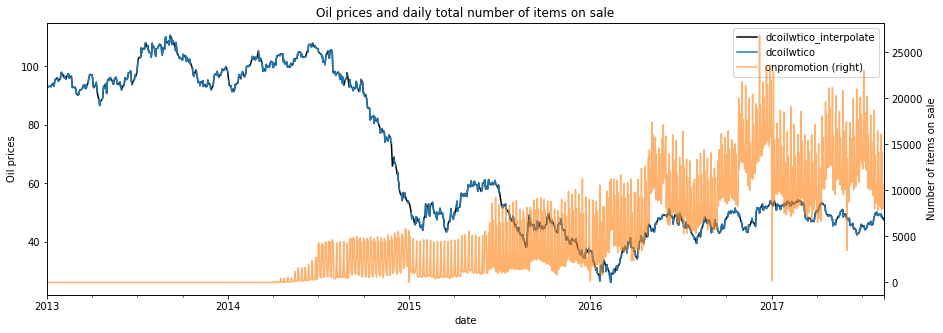
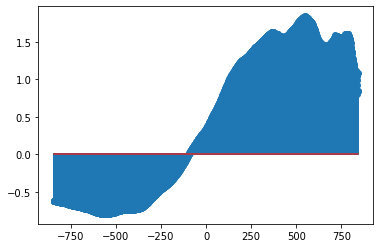
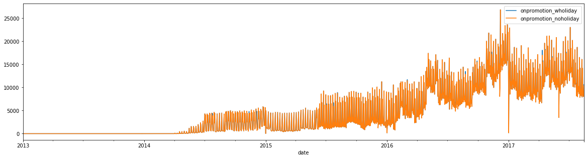
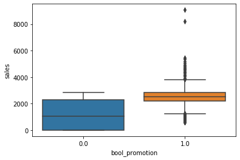
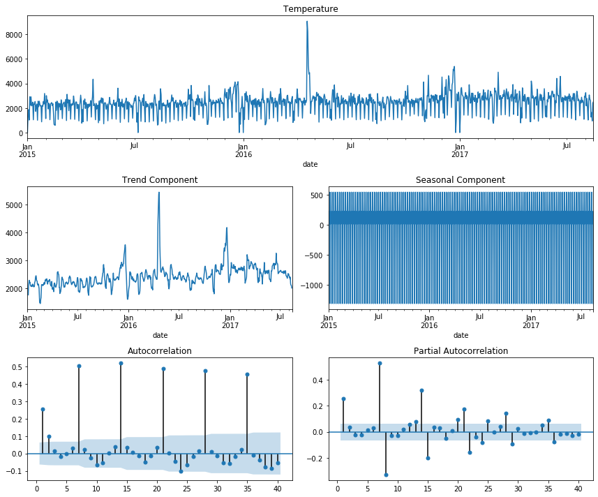
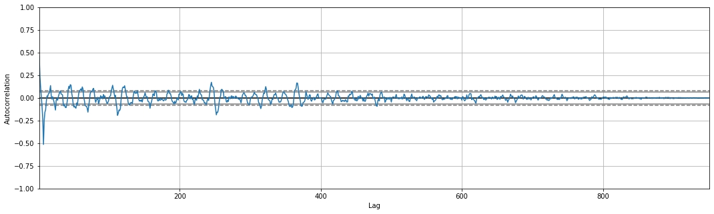
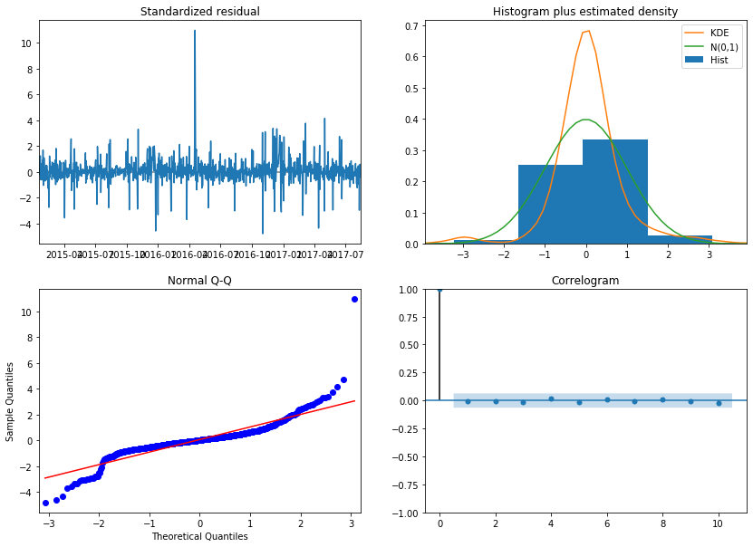
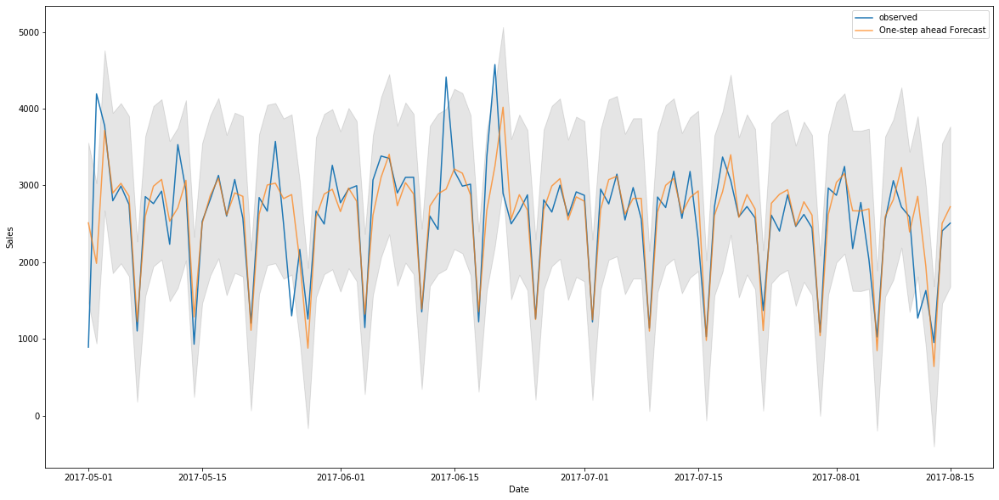
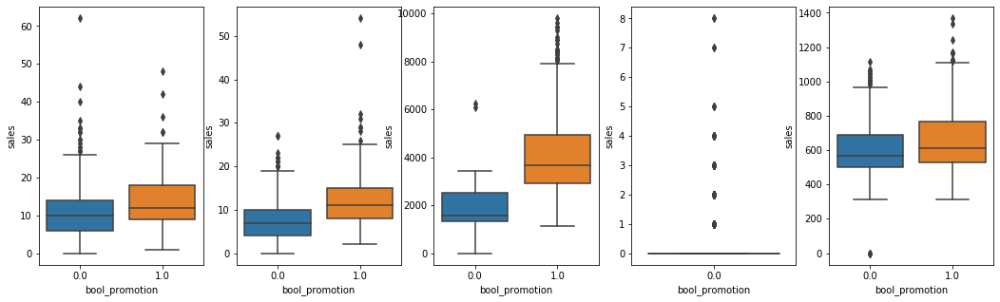

# ANALYSIS OF THE EFFECT OF PROMOTION ON SALES

For this project, I want to examine if having promotions positively on product sales of this grocery chains. This notebook is an ongoing work documenting my analyses and findings. It starts out with some EDA to understand the dataset and to have an intial visual check for the relationship between sales and other variables. The second part is to use traditional time-series seasonal ARIMA model to fit the data and examine the resulting statistics to see if the relationship is significant. 

The write-up of this project is being done along with this notebook: You can access it [here](https://docs.google.com/document/d/17K_Orm-841ehCpNxM86i9xVOcd3ARoUdNV-BwFXaDFY/edit?usp=sharing).

#### Table of contents:

* [1. Overview](#1-overview)
* [2. Sales of different products by promotion](#2-sales-of-different-products-by-promotion)
* [3. Locations](#3-locations)
* [4. Oil prices](#4-is-there-more-promotions-if-oil-prices-rise)
* [5. Holidays and promotions](#5-holidays-and-promotions)
* [6. Are promotions effective?](#6-are-promotions-effective)
  * [6.1 Checking the condition](#1-checking-the-conditions)
  * [6.2 Examine one SARIMAX model](#2-fit-sarimax-model)
  * [6.3 Promotion on sales of all products](#3-promotion-impact-on-sales-of-all-products)

_This project is made possible with the help of my mentors: Chaya, Kyle, Jeremy. Thank you so much!_


```python
# import the libraries and connect to the database
import mysql.connector
import pandas as pd
import numpy as np
import matplotlib.pyplot as plt
import seaborn as sns
%matplotlib inline
# restart a new connection
conn = mysql.connector.connect(user='root', password='sql',
                              host='localhost')
cur = conn.cursor(buffered=True)
cur.execute("USE `sales`")
```

## 1. Overview <a class="anchor" id="1-overview"></a>

#### Sales and number of transactions


```python
# correlation between transactions and sales
sql = '''
    with cte as (
        select date, store_nbr, sum(sales) as sales
        from train
        group by date, store_nbr
    )
    select transactions, sales
    from cte left join transactions t on t.date = cte.date and cte.store_nbr = t.store_nbr;
'''
cur.execute(sql)
query = cur.fetchall()
sales_trans = pd.DataFrame(query, columns=['transactions', 'sales'])
sales_trans.head()
```


<div>
<style scoped>
    .dataframe tbody tr th:only-of-type {
        vertical-align: middle;
    }

    .dataframe tbody tr th {
        vertical-align: top;
    }

    .dataframe thead th {
        text-align: right;
    }
</style>
<table border="1" class="dataframe">
  <thead>
    <tr style="text-align: right;">
      <th></th>
      <th>transactions</th>
      <th>sales</th>
    </tr>
  </thead>
  <tbody>
    <tr>
      <th>0</th>
      <td>770.0</td>
      <td>2511.619003</td>
    </tr>
    <tr>
      <th>1</th>
      <td>2111.0</td>
      <td>7417.148018</td>
    </tr>
    <tr>
      <th>2</th>
      <td>1293.0</td>
      <td>5430.088013</td>
    </tr>
    <tr>
      <th>3</th>
      <td>3547.0</td>
      <td>18329.638004</td>
    </tr>
    <tr>
      <th>4</th>
      <td>1362.0</td>
      <td>5854.516998</td>
    </tr>
  </tbody>
</table>
</div>


```python
sales_trans.transactions = sales_trans.transactions.astype('float')
# correlation between transactions and sales
sales_trans['transactions'].corr(sales_trans['sales'], method='pearson')
```


    0.8373836801653558


```python
g = sns.regplot(x='transactions', y='sales', data=sales_trans, line_kws={"color":"r"})
g.set_xlabel("Transactions", fontsize = 20)
g.set_ylabel("Sales", fontsize = 20)
corr = round(sales_trans['transactions'].corr(sales_trans['sales'], method='pearson'), 2)
g.set_yticklabels(labels = np.arange(-2, 16, 2))
g.set_xticklabels(labels = np.arange(-1, 9, 1))
g.annotate("corr: {}".format(corr), (6000, 130000), fontsize=14)
plt.show()
```


## 2. Sales of different products by promotion


```python
sql ='''
select family, sales, onpromotion from train;
'''
cur.execute(sql)
query = cur.fetchall()
sales_promotion = pd.DataFrame(query, columns=['family', 'sales', 'onpromotion'])
sales_promotion.head()
```


<div>
<style scoped>
    .dataframe tbody tr th:only-of-type {
        vertical-align: middle;
    }

    .dataframe tbody tr th {
        vertical-align: top;
    }

    .dataframe thead th {
        text-align: right;
    }
</style>
<table border="1" class="dataframe">
  <thead>
    <tr style="text-align: right;">
      <th></th>
      <th>family</th>
      <th>sales</th>
      <th>onpromotion</th>
    </tr>
  </thead>
  <tbody>
    <tr>
      <th>0</th>
      <td>AUTOMOTIVE</td>
      <td>0.0</td>
      <td>0</td>
    </tr>
    <tr>
      <th>1</th>
      <td>BABY CARE</td>
      <td>0.0</td>
      <td>0</td>
    </tr>
    <tr>
      <th>2</th>
      <td>BEAUTY</td>
      <td>0.0</td>
      <td>0</td>
    </tr>
    <tr>
      <th>3</th>
      <td>BEVERAGES</td>
      <td>0.0</td>
      <td>0</td>
    </tr>
    <tr>
      <th>4</th>
      <td>BOOKS</td>
      <td>0.0</td>
      <td>0</td>
    </tr>
  </tbody>
</table>
</div>


```python
fig, axes = plt.subplots(7, 5, figsize = (20, 20))

for i, product in enumerate(np.unique(sales_promotion.family)):
    temp = sales_promotion[sales_promotion.family == product]
    temp.plot.scatter(x = "onpromotion", y = "sales", ax=axes[int(i/5)][i%5])
    this_corr = round(temp['sales'].corr(temp['onpromotion'], method='kendall'), 3)
    axes[int(i/5)][i%5].set_title("{} \n r = {}".format(product, this_corr))

plt.tight_layout(pad=5)
plt.suptitle("Daily Number of Items On Promotion vs Family Sales \n", fontsize = 20)
plt.show()
```


## 3. Locations


```python
sql ='''
select t.date, t.store_nbr, city, state, type, cluster, onpromotion, transactions
from transactions t inner join store_train s on t.store_nbr=s.store_nbr and t.date = s.date;
'''
cur.execute(sql)
query = cur.fetchall()
store_promotion = pd.DataFrame(query, columns=['date', 'store_nbr', 'city','state','type','cluster','onpromotion', 'transactions'])
store_promotion.head()
```


<div>
<style scoped>
    .dataframe tbody tr th:only-of-type {
        vertical-align: middle;
    }

    .dataframe tbody tr th {
        vertical-align: top;
    }

    .dataframe thead th {
        text-align: right;
    }
</style>
<table border="1" class="dataframe">
  <thead>
    <tr style="text-align: right;">
      <th></th>
      <th>date</th>
      <th>store_nbr</th>
      <th>city</th>
      <th>state</th>
      <th>type</th>
      <th>cluster</th>
      <th>onpromotion</th>
      <th>transactions</th>
    </tr>
  </thead>
  <tbody>
    <tr>
      <th>0</th>
      <td>2013-01-01</td>
      <td>25</td>
      <td>Salinas</td>
      <td>Santa Elena</td>
      <td>D</td>
      <td>1</td>
      <td>0</td>
      <td>770</td>
    </tr>
    <tr>
      <th>1</th>
      <td>2013-01-02</td>
      <td>1</td>
      <td>Quito</td>
      <td>Pichincha</td>
      <td>D</td>
      <td>13</td>
      <td>0</td>
      <td>2111</td>
    </tr>
    <tr>
      <th>2</th>
      <td>2013-01-02</td>
      <td>10</td>
      <td>Quito</td>
      <td>Pichincha</td>
      <td>C</td>
      <td>15</td>
      <td>0</td>
      <td>1293</td>
    </tr>
    <tr>
      <th>3</th>
      <td>2013-01-02</td>
      <td>11</td>
      <td>Cayambe</td>
      <td>Pichincha</td>
      <td>B</td>
      <td>6</td>
      <td>0</td>
      <td>3547</td>
    </tr>
    <tr>
      <th>4</th>
      <td>2013-01-02</td>
      <td>12</td>
      <td>Latacunga</td>
      <td>Cotopaxi</td>
      <td>C</td>
      <td>15</td>
      <td>0</td>
      <td>1362</td>
    </tr>
  </tbody>
</table>
</div>


```python
global_mean = store_promotion.transactions.mean()
```

#### City


```python
fig, axes = plt.subplots(5, 5, figsize = (20, 20))

for i, city in enumerate(np.unique(store_promotion.city)):
    temp = store_promotion[store_promotion.city == city]
    temp.plot.scatter(x = "onpromotion", y = "transactions", ax=axes[int(i/5)][i%5])
    n = len(temp)
    axes[int(i/5)][i%5].set_title("{} \n n = {}".format(city, n))
    axes[int(i/5)][i%5].set_ylabel("Transactions (units)", fontsize = 12)
    axes[int(i/5)][i%5].set_xlabel("Onpromotion (items)", fontsize = 12)

plt.tight_layout(pad=5)
plt.suptitle("Daily Number of Items On Promotion vs Transactions by City\n", fontsize = 20)
plt.show()
```


#### State


```python
fig, axes = plt.subplots(4, 4, figsize = (15, 15))

for i, state in enumerate(np.unique(store_promotion.state)):
    temp = store_promotion[store_promotion.state == state]
    temp.plot.scatter(x = "onpromotion", y = "transactions", ax=axes[int(i/4)][i%4])
    n = len(temp)
    axes[int(i/4)][i%4].set_title("{} \n n = {}".format(state, n))
    axes[int(i/4)][i%4].set_ylabel("Transactions (units)", fontsize = 12)
    axes[int(i/4)][i%4].set_xlabel("Onpromotion (items)", fontsize = 12)

plt.tight_layout(pad=5)
plt.suptitle("Daily Number of Items On Promotion vs Transactions by State\n", fontsize = 20)
plt.show()
```


#### Store types


```python
fig, axes = plt.subplots(1, 5, figsize = (20, 5))

for i, type in enumerate(np.unique(store_promotion.type)):
    temp = store_promotion[store_promotion.type == type]
    temp.plot.scatter(x = "onpromotion", y = "transactions", ax=axes[i])
    n = len(temp)
    axes[i].set_title("{} \n n = {}".format(type, n))
    axes[i].set_ylabel("Transactions (units)", fontsize = 12)
    axes[i].set_xlabel("Onpromotion (items)", fontsize = 12)

plt.tight_layout(pad=5)
plt.suptitle("Daily Number of Items On Promotion vs Transactions By Store Types \n", fontsize = 20)
plt.show()

```


#### Cluster


```python
fig, axes = plt.subplots(4, 5, figsize = (20, 15))

for i, cluster in enumerate(np.unique(store_promotion.cluster)):
    temp = store_promotion[store_promotion.cluster == cluster]
    temp.plot.scatter(x = "onpromotion", y = "transactions", ax=axes[int(i/5)][i%5])
    n = len(temp)
    axes[int(i/5)][i%5].set_title("{} \n n = {}".format(cluster, n))
    axes[int(i/5)][i%5].set_ylabel("Transactions (units)", fontsize = 12)
    axes[int(i/5)][i%5].set_xlabel("Onpromotion (items)", fontsize = 12)

plt.tight_layout(pad=5)
plt.suptitle("Daily Number of Items On Promotion vs Transactions by Cluster \n", fontsize = 20)
plt.show()
```


#### a. Cluster 3 and 13


```python
small_cluster = store_promotion[(store_promotion.cluster == 3) | (store_promotion.cluster == 13)]
sns.kdeplot(small_cluster[small_cluster.onpromotion >= 500]['transactions'], color = 'black')
sns.kdeplot(small_cluster[small_cluster.onpromotion < 500]['transactions'], color='blue')
plt.title("Number of Transactions of Cluster 3 and 13")
plt.axvline(x = small_cluster[small_cluster.onpromotion >= 500].transactions.mean(), linestyle = '--', color='black', label='larger than 500 \n n = {}'.format(
    len(small_cluster[small_cluster.onpromotion >= 500]['transactions'])
))
plt.axvline(x = small_cluster[small_cluster.onpromotion < 500].transactions.mean(), linestyle = '-', color='blue', label='smaller than 500 \n n = {}'.format(
    len(small_cluster[small_cluster.onpromotion < 500]['transactions'])
))
plt.legend()
plt.show()
```


#### b. Cities El Carmen, Manta, Playas, Santo Domingo and Quevedo


```python
city_cluster = store_promotion[(store_promotion.city == 'El Carmen') | (store_promotion.city == 'Manta') | (store_promotion.city == 'Playas') | (store_promotion.city == 'Santo Domingo') | (store_promotion.city == 'Quevedo')]
sns.kdeplot(city_cluster[city_cluster.onpromotion >= 500]['transactions'], color = 'black')
sns.kdeplot(city_cluster[city_cluster.onpromotion < 500]['transactions'], color='blue')
plt.title("Number of Transactions of El Carmen, Manta, Playas, \n Santo Domingo and Quevedo")
plt.axvline(x = city_cluster[city_cluster.onpromotion >= 500].transactions.mean(), linestyle = '--', color='black', label='larger than 500 \n n = {}'.format(
    len(city_cluster[city_cluster.onpromotion >= 500]['transactions'])
))
plt.axvline(x = city_cluster[city_cluster.onpromotion < 500].transactions.mean(), linestyle = '-', color='blue', label='smaller than 500 \n n = {}'.format(
    len(city_cluster[city_cluster.onpromotion < 500]['transactions'])
))
plt.legend()
plt.show()
```


## 4. Is there more promotions if oil prices rise?


```python
oil_data = pd.read_csv('oil.csv')
oil_data.date = pd.to_datetime(oil_data.date)
oil_data.head()
```


<div>
<style scoped>
    .dataframe tbody tr th:only-of-type {
        vertical-align: middle;
    }

    .dataframe tbody tr th {
        vertical-align: top;
    }

    .dataframe thead th {
        text-align: right;
    }
</style>
<table border="1" class="dataframe">
  <thead>
    <tr style="text-align: right;">
      <th></th>
      <th>date</th>
      <th>dcoilwtico</th>
    </tr>
  </thead>
  <tbody>
    <tr>
      <th>0</th>
      <td>2013-01-01</td>
      <td>NaN</td>
    </tr>
    <tr>
      <th>1</th>
      <td>2013-01-02</td>
      <td>93.14</td>
    </tr>
    <tr>
      <th>2</th>
      <td>2013-01-03</td>
      <td>92.97</td>
    </tr>
    <tr>
      <th>3</th>
      <td>2013-01-04</td>
      <td>93.12</td>
    </tr>
    <tr>
      <th>4</th>
      <td>2013-01-07</td>
      <td>93.20</td>
    </tr>
  </tbody>
</table>
</div>


```python
# examine the average monthly transactions
sql = "SELECT date, sum(onpromotion) as onpromotion FROM train GROUP BY date"
cur.execute(sql)
query = cur.fetchall()
monthly_transactions = pd.DataFrame(query, columns=['date', "onpromotion"])
monthly_transactions.date = pd.to_datetime(monthly_transactions.date)
monthly_transactions.head()
```


<div>
<style scoped>
    .dataframe tbody tr th:only-of-type {
        vertical-align: middle;
    }

    .dataframe tbody tr th {
        vertical-align: top;
    }

    .dataframe thead th {
        text-align: right;
    }
</style>
<table border="1" class="dataframe">
  <thead>
    <tr style="text-align: right;">
      <th></th>
      <th>date</th>
      <th>onpromotion</th>
    </tr>
  </thead>
  <tbody>
    <tr>
      <th>0</th>
      <td>2013-01-01</td>
      <td>0</td>
    </tr>
    <tr>
      <th>1</th>
      <td>2013-01-02</td>
      <td>0</td>
    </tr>
    <tr>
      <th>2</th>
      <td>2013-01-03</td>
      <td>0</td>
    </tr>
    <tr>
      <th>3</th>
      <td>2013-01-04</td>
      <td>0</td>
    </tr>
    <tr>
      <th>4</th>
      <td>2013-01-05</td>
      <td>0</td>
    </tr>
  </tbody>
</table>
</div>


```python
continuous_date = pd.DataFrame(pd.date_range(start='1/1/2013', end='15/08/2017'), columns=['date'])
oil_transactions = continuous_date.merge(monthly_transactions, how='left', on='date')
oil_transactions = oil_transactions.merge(oil_data, how='left', on='date')
```


```python
oil_transactions['dcoilwtico_interpolate'] = oil_transactions.dcoilwtico.interpolate()
oil_transactions.onpromotion = oil_transactions.onpromotion.astype('float')
oil_transactions.head()
```


<div>
<style scoped>
    .dataframe tbody tr th:only-of-type {
        vertical-align: middle;
    }

    .dataframe tbody tr th {
        vertical-align: top;
    }

    .dataframe thead th {
        text-align: right;
    }
</style>
<table border="1" class="dataframe">
  <thead>
    <tr style="text-align: right;">
      <th></th>
      <th>date</th>
      <th>onpromotion</th>
      <th>dcoilwtico</th>
      <th>dcoilwtico_interpolate</th>
    </tr>
  </thead>
  <tbody>
    <tr>
      <th>0</th>
      <td>2013-01-01</td>
      <td>0.0</td>
      <td>NaN</td>
      <td>NaN</td>
    </tr>
    <tr>
      <th>1</th>
      <td>2013-01-02</td>
      <td>0.0</td>
      <td>93.14</td>
      <td>93.140000</td>
    </tr>
    <tr>
      <th>2</th>
      <td>2013-01-03</td>
      <td>0.0</td>
      <td>92.97</td>
      <td>92.970000</td>
    </tr>
    <tr>
      <th>3</th>
      <td>2013-01-04</td>
      <td>0.0</td>
      <td>93.12</td>
      <td>93.120000</td>
    </tr>
    <tr>
      <th>4</th>
      <td>2013-01-05</td>
      <td>0.0</td>
      <td>NaN</td>
      <td>93.146667</td>
    </tr>
  </tbody>
</table>
</div>


```python
fig, ax = plt.subplots(figsize = (15, 5))
oil_transactions.plot(ax = ax, x = 'date', y = 'dcoilwtico_interpolate',  color = 'black')
oil_transactions.plot(ax = ax, x = 'date', y = 'dcoilwtico')
oil_transactions.plot(ax = ax, x = 'date', y = 'onpromotion', secondary_y=True, ylabel = 'Oil prices', alpha = 0.6)
plt.title('Oil prices and daily total number of items on sale')
plt.ylabel("Number of items on sale")
plt.show()
```





```python
import statsmodels.tsa.stattools as smt
x = oil_transactions['onpromotion'].interpolate()[1:]
y = oil_transactions['dcoilwtico_interpolate'].interpolate()[1:]

z = smt.ccf(x, y)
plt.stem(range(-len(z)//2, len(z)//2), z)
```

    /opt/anaconda3/lib/python3.7/site-packages/ipykernel_launcher.py:6: UserWarning: In Matplotlib 3.3 individual lines on a stem plot will be added as a LineCollection instead of individual lines. This significantly improves the performance of a stem plot. To remove this warning and switch to the new behaviour, set the "use_line_collection" keyword argument to True.
      


    <StemContainer object of 3 artists>





## 5. Holidays and promotions

#### Number of promotions holiday vs no holiday


```python
no_holiday = pd.read_csv('train_wo_holiday.csv')
no_holiday.date = pd.to_datetime(no_holiday.date)
no_holiday = no_holiday[['date', 'onpromotion']].groupby('date').aggregate('sum').reset_index()
```


```python
holiday_df = continuous_date.merge(monthly_transactions, how='left', on='date')
holiday_df = holiday_df.merge(no_holiday, how='left', on='date', suffixes = ('_wholiday', '_noholiday'))
holiday_df.onpromotion_wholiday = holiday_df.onpromotion_wholiday.astype('float')
holiday_df.head()
```


<div>
<style scoped>
    .dataframe tbody tr th:only-of-type {
        vertical-align: middle;
    }

    .dataframe tbody tr th {
        vertical-align: top;
    }

    .dataframe thead th {
        text-align: right;
    }
</style>
<table border="1" class="dataframe">
  <thead>
    <tr style="text-align: right;">
      <th></th>
      <th>date</th>
      <th>onpromotion_wholiday</th>
      <th>onpromotion_noholiday</th>
    </tr>
  </thead>
  <tbody>
    <tr>
      <th>0</th>
      <td>2013-01-01</td>
      <td>0.0</td>
      <td>0.0</td>
    </tr>
    <tr>
      <th>1</th>
      <td>2013-01-02</td>
      <td>0.0</td>
      <td>0.0</td>
    </tr>
    <tr>
      <th>2</th>
      <td>2013-01-03</td>
      <td>0.0</td>
      <td>0.0</td>
    </tr>
    <tr>
      <th>3</th>
      <td>2013-01-04</td>
      <td>0.0</td>
      <td>0.0</td>
    </tr>
    <tr>
      <th>4</th>
      <td>2013-01-05</td>
      <td>0.0</td>
      <td>0.0</td>
    </tr>
  </tbody>
</table>
</div>


```python
fig, ax = plt.subplots(figsize = (20, 5))
holiday_df.plot(ax = ax, x = 'date', y = 'onpromotion_wholiday',  kind = 'line')
holiday_df.plot(ax = ax, x = 'date', y = 'onpromotion_noholiday',  kind = 'line')
plt.show()
```





#### Holiday type


```python
holidays = pd.read_csv('holidays_events.csv')
holidays.head()
```


<div>
<style scoped>
    .dataframe tbody tr th:only-of-type {
        vertical-align: middle;
    }

    .dataframe tbody tr th {
        vertical-align: top;
    }

    .dataframe thead th {
        text-align: right;
    }
</style>
<table border="1" class="dataframe">
  <thead>
    <tr style="text-align: right;">
      <th></th>
      <th>date</th>
      <th>type</th>
      <th>locale</th>
      <th>locale_name</th>
      <th>description</th>
      <th>transferred</th>
    </tr>
  </thead>
  <tbody>
    <tr>
      <th>0</th>
      <td>2012-03-02</td>
      <td>Holiday</td>
      <td>Local</td>
      <td>Manta</td>
      <td>Fundacion de Manta</td>
      <td>False</td>
    </tr>
    <tr>
      <th>1</th>
      <td>2012-04-01</td>
      <td>Holiday</td>
      <td>Regional</td>
      <td>Cotopaxi</td>
      <td>Provincializacion de Cotopaxi</td>
      <td>False</td>
    </tr>
    <tr>
      <th>2</th>
      <td>2012-04-12</td>
      <td>Holiday</td>
      <td>Local</td>
      <td>Cuenca</td>
      <td>Fundacion de Cuenca</td>
      <td>False</td>
    </tr>
    <tr>
      <th>3</th>
      <td>2012-04-14</td>
      <td>Holiday</td>
      <td>Local</td>
      <td>Libertad</td>
      <td>Cantonizacion de Libertad</td>
      <td>False</td>
    </tr>
    <tr>
      <th>4</th>
      <td>2012-04-21</td>
      <td>Holiday</td>
      <td>Local</td>
      <td>Riobamba</td>
      <td>Cantonizacion de Riobamba</td>
      <td>False</td>
    </tr>
  </tbody>
</table>
</div>


```python
holidays.locale.value_counts()
```


    National    174
    Local       152
    Regional     24
    Name: locale, dtype: int64


## 6. Are promotions effective? <a class="anchor" id="6-are-promotions-effective"></a>
In order to examine the effect of promotion, I narrowed the scope of analysis down to the most granular level possible. This will eliminate the effect of other variables not of interest (different stores, different products, different cities). I started off by filtering out sales of Grocery I from store 1 in Quito to see if the analysis is possible/interesting enough to pursue. Using traditional methods of analyzing time series, I investigated trend and seasonality in the dataset, then I handpicked the parameters for my SARIMAX model accordingly. auto_arima() is used to cross-check the results, making sure the discrepancy in the parameters is not too substantial.

After that, I went on to fit auto_arima to all the combinations of store-city-product and select those combinations that yield significant p-values. These are the cases where promotions have an positive effect on sales.

  * [6.1 Checking the condition](#1-checking-the-conditions)
  * [6.2 Examine one SARIMAX model](#2-fit-sarimax-model)
  * [6.3 Promotion on sales of all products](#3-promotion-impact-on-sales-of-all-products)

(Note for bugs and potential problems)

#### Getting and wrangling the data


```python
# take since 2015 because the pattern is similar and repeated
sql ='''
select date, train.store_nbr, family,city, sales, onpromotion from train
inner join stores using(store_nbr) where year(date) >= 2015;
'''
cur.execute(sql)
query = cur.fetchall()
main = pd.DataFrame(query, columns=['date', 'store_nbr','family','city', 'sales', 'onpromotion'])
main.date = pd.to_datetime(main.date)
main.head()
```


<div>
<style scoped>
    .dataframe tbody tr th:only-of-type {
        vertical-align: middle;
    }

    .dataframe tbody tr th {
        vertical-align: top;
    }

    .dataframe thead th {
        text-align: right;
    }
</style>
<table border="1" class="dataframe">
  <thead>
    <tr style="text-align: right;">
      <th></th>
      <th>date</th>
      <th>store_nbr</th>
      <th>family</th>
      <th>city</th>
      <th>sales</th>
      <th>onpromotion</th>
    </tr>
  </thead>
  <tbody>
    <tr>
      <th>0</th>
      <td>2015-01-01</td>
      <td>1</td>
      <td>AUTOMOTIVE</td>
      <td>Quito</td>
      <td>0.0</td>
      <td>0</td>
    </tr>
    <tr>
      <th>1</th>
      <td>2015-01-01</td>
      <td>1</td>
      <td>BABY CARE</td>
      <td>Quito</td>
      <td>0.0</td>
      <td>0</td>
    </tr>
    <tr>
      <th>2</th>
      <td>2015-01-01</td>
      <td>1</td>
      <td>BEAUTY</td>
      <td>Quito</td>
      <td>0.0</td>
      <td>0</td>
    </tr>
    <tr>
      <th>3</th>
      <td>2015-01-01</td>
      <td>1</td>
      <td>BEVERAGES</td>
      <td>Quito</td>
      <td>0.0</td>
      <td>0</td>
    </tr>
    <tr>
      <th>4</th>
      <td>2015-01-01</td>
      <td>1</td>
      <td>BOOKS</td>
      <td>Quito</td>
      <td>0.0</td>
      <td>0</td>
    </tr>
  </tbody>
</table>
</div>


```python
# investigate at the highest granularity level: at store 1, grocery I family, in Quito, excluding all the holidays
granular_df = main[(main.city == 'Quito') & (main.family == 'GROCERY I') & (main.store_nbr == 1)]
granular_df.reset_index(inplace = True, drop = True)
print("Total sample size is: ", len(granular_df))
print(granular_df.head())
```

    Total sample size is:  956
            date  store_nbr     family   city   sales  onpromotion
    0 2015-01-01          1  GROCERY I  Quito     0.0            0
    1 2015-01-02          1  GROCERY I  Quito  1418.0            9
    2 2015-01-03          1  GROCERY I  Quito  1869.0            9
    3 2015-01-04          1  GROCERY I  Quito  1020.0           19
    4 2015-01-05          1  GROCERY I  Quito  2914.0           16


```python
# create a column to indicate whether the family product is on promotion OR not
granular_df['bool_promotion'] = [0 if x == 0 else 1 for x in granular_df.onpromotion]

# create continuous date for the data
continuous_date = pd.DataFrame(pd.date_range(start='1/1/2015', end='15/08/2017'), columns=['date'])
continuous_date = continuous_date.merge(granular_df, how='left', on='date')
continuous_date.drop(['store_nbr', 'city', 'family'], axis=1, inplace=True)

# cleaning up the missing values
continuous_date.sales = continuous_date.sales.fillna(0)
continuous_date.onpromotion = continuous_date.onpromotion.fillna(0)
continuous_date.bool_promotion = continuous_date.bool_promotion.fillna(0)

continuous_date.isnull().sum()
```

    /opt/anaconda3/lib/python3.7/site-packages/ipykernel_launcher.py:2: SettingWithCopyWarning: 
    A value is trying to be set on a copy of a slice from a DataFrame.
    Try using .loc[row_indexer,col_indexer] = value instead
    
    See the caveats in the documentation: https://pandas.pydata.org/pandas-docs/stable/user_guide/indexing.html#returning-a-view-versus-a-copy
      


    date              0
    sales             0
    onpromotion       0
    bool_promotion    0
    dtype: int64


```python
continuous_date.bool_promotion.value_counts()
```


    1.0    938
    0.0     20
    Name: bool_promotion, dtype: int64


```python
continuous_date.set_index('date', inplace = True)
```

#### Visualize this subset of data


```python
# visually check the relationship
sns.boxplot(continuous_date['bool_promotion'], continuous_date['sales'])
```

    /opt/anaconda3/lib/python3.7/site-packages/seaborn/_decorators.py:43: FutureWarning: Pass the following variables as keyword args: x, y. From version 0.12, the only valid positional argument will be `data`, and passing other arguments without an explicit keyword will result in an error or misinterpretation.
      FutureWarning


    <matplotlib.axes._subplots.AxesSubplot at 0x7fa1926eaf10>





```python
from statsmodels.tsa.seasonal import seasonal_decompose
from statsmodels.graphics.tsaplots import plot_acf, plot_pacf

def plot_stationarity(y, lags):
   
    y = pd.Series(y)

    # decompose the time series into trend, seasonality and residuals
    decomp = seasonal_decompose(y)
    trend = decomp.trend
    seas = decomp.seasonal
   

    fig = plt.figure()
    fig.set_figheight(10)
    fig.set_figwidth(18)
    

    ax1 = plt.subplot2grid((3, 3), (0, 0), colspan=2)
    ax2 = plt.subplot2grid((3, 3), (1, 0))
    ax3 = plt.subplot2grid((3, 3), (1, 1))
    ax5 = plt.subplot2grid((3, 3), (2, 0))
    ax6 = plt.subplot2grid((3, 3), (2, 1))

    y.plot(ax=ax1)
    ax1.set_title("Temperature")

    trend.plot(ax=ax2)
    ax2.set_title("Trend Component")

    seas.plot(ax=ax3)
    ax3.set_title("Seasonal Component")
    
    plot_acf(y, lags=lags, zero=False, ax=ax5);
    plot_pacf(y, lags=lags, zero=False, ax=ax6);

    plt.tight_layout()

plot_stationarity(continuous_date['sales'], 40)
```





Mean is not constant and acf plot shows seasonality at lag 7

### 1. Checking the conditions

#### Stationarity diagnostics


```python
# checking stationarity
from statsmodels.tsa.stattools import adfuller, kpss

# ADF Test
# null hypothesis: There is a unit root and the series is NOT stationary 
def ADF_statt(x):
    adf_test = adfuller(x, autolag="aic")
    t_stat, p_value, _, _, _, _  = adf_test
    conclusion = "non-stationary (unit root)" if p_value > 0.05 else "stationary"
    res_dict = {"ADF statistic":t_stat, "p-value":p_value, "should we difference?": (p_value > 0.05), "conclusion": conclusion}
    return res_dict


# call the ADF test:
resADF = ADF_statt(continuous_date.sales)

# KPSS Test
# null hypothesis: There series is (at least trend-)stationary 
def KPSS_statt(x):
    kpss_test = kpss(x)
    t_stat, p_value, _, critical_values  = kpss_test
    conclusion = "stationary" if p_value > 0.05 else "not stationary"
    res_dict = {"KPSS statistic":t_stat, "p-value":p_value, "should we difference?": (p_value < 0.05), "conclusion": conclusion}
    return res_dict


# call the KPSS test:
resKPSS = KPSS_statt(continuous_date.sales)
```

    /opt/anaconda3/lib/python3.7/site-packages/statsmodels/tsa/stattools.py:1661: FutureWarning: The behavior of using lags=None will change in the next release. Currently lags=None is the same as lags='legacy', and so a sample-size lag length is used. After the next release, the default will change to be the same as lags='auto' which uses an automatic lag length selection method. To silence this warning, either use 'auto' or 'legacy'
      warn(msg, FutureWarning)
    /opt/anaconda3/lib/python3.7/site-packages/statsmodels/tsa/stattools.py:1685: InterpolationWarning: p-value is smaller than the indicated p-value
      warn("p-value is smaller than the indicated p-value", InterpolationWarning)


```python
# compare ADF and KPSS result
test_values = zip(resADF.values(), resKPSS.values())
dict_tests = dict(zip(resADF.keys(), test_values))
df_tests = pd.DataFrame().from_dict(dict_tests).transpose()
df_tests.columns = ["ADF", "KPSS"]
print("Stationarity Tests for original data, before differencing:")
df_tests
```

    Stationarity Tests for original data, before differencing:


<div>
<style scoped>
    .dataframe tbody tr th:only-of-type {
        vertical-align: middle;
    }

    .dataframe tbody tr th {
        vertical-align: top;
    }

    .dataframe thead th {
        text-align: right;
    }
</style>
<table border="1" class="dataframe">
  <thead>
    <tr style="text-align: right;">
      <th></th>
      <th>ADF</th>
      <th>KPSS</th>
    </tr>
  </thead>
  <tbody>
    <tr>
      <th>ADF statistic</th>
      <td>-4.302511</td>
      <td>1.648345</td>
    </tr>
    <tr>
      <th>p-value</th>
      <td>0.00044</td>
      <td>0.01</td>
    </tr>
    <tr>
      <th>should we difference?</th>
      <td>False</td>
      <td>True</td>
    </tr>
    <tr>
      <th>conclusion</th>
      <td>stationary</td>
      <td>not stationary</td>
    </tr>
  </tbody>
</table>
</div>


#### First differencing -- eliminate trend and restore stationarity


```python
# pmdarima also offers methods that suggest the order of first differencing, based on either ADF or the KPSS test
import pmdarima as pmd
n_adf = pmd.arima.ndiffs(continuous_date.sales, test="adf")
n_kpss = pmd.arima.ndiffs(continuous_date.sales, test="kpss")
n_diffs = {"ADF ndiff":n_adf, "KPSS ndiff":n_kpss}
print("recommended order of first differencing for original data:")
[print(key, ":", value) for key,value in n_diffs.items()]
```

    recommended order of first differencing for original data:
    ADF ndiff : 0
    KPSS ndiff : 1


    [None, None]


```python
# differencing following the diagnostics

# ADF and KPSS tests after differencing:

n_diff = max(n_adf, n_kpss)   
df_diff1 = continuous_date.diff(n_diff).dropna()['sales']

resADF = ADF_statt(df_diff1)
resKPSS = KPSS_statt(df_diff1)
test_values = zip(resADF.values(), resKPSS.values())
dict_tests = dict(zip(resADF.keys(), test_values))
df_tests = pd.DataFrame().from_dict(dict_tests).transpose()
df_tests.columns = ["ADF", "KPSS"]

print("Stationary after 1 round of first-differencing?")
df_tests
```

    Stationary after 1 round of first-differencing?


    /opt/anaconda3/lib/python3.7/site-packages/statsmodels/tsa/stattools.py:1661: FutureWarning: The behavior of using lags=None will change in the next release. Currently lags=None is the same as lags='legacy', and so a sample-size lag length is used. After the next release, the default will change to be the same as lags='auto' which uses an automatic lag length selection method. To silence this warning, either use 'auto' or 'legacy'
      warn(msg, FutureWarning)
    /opt/anaconda3/lib/python3.7/site-packages/statsmodels/tsa/stattools.py:1687: InterpolationWarning: p-value is greater than the indicated p-value
      warn("p-value is greater than the indicated p-value", InterpolationWarning)


<div>
<style scoped>
    .dataframe tbody tr th:only-of-type {
        vertical-align: middle;
    }

    .dataframe tbody tr th {
        vertical-align: top;
    }

    .dataframe thead th {
        text-align: right;
    }
</style>
<table border="1" class="dataframe">
  <thead>
    <tr style="text-align: right;">
      <th></th>
      <th>ADF</th>
      <th>KPSS</th>
    </tr>
  </thead>
  <tbody>
    <tr>
      <th>ADF statistic</th>
      <td>-10.625869</td>
      <td>0.036404</td>
    </tr>
    <tr>
      <th>p-value</th>
      <td>0.0</td>
      <td>0.1</td>
    </tr>
    <tr>
      <th>should we difference?</th>
      <td>False</td>
      <td>False</td>
    </tr>
    <tr>
      <th>conclusion</th>
      <td>stationary</td>
      <td>stationary</td>
    </tr>
  </tbody>
</table>
</div>


```python
plot_stationarity(df_diff1, 40)
```


However, after the first difference, we can see that the autocorrelation plunges right to big negative values, which implies that we are over-differencing. Hence, I'll just leave it as is. We do notice that there is a significant seasonal component of this time series, which we are going to handle next.

#### Seasonal differencing


```python
seasonal_diff = continuous_date.diff(7).dropna()['sales']

resADF2 = ADF_statt(seasonal_diff)
resKPSS2 = KPSS_statt(seasonal_diff)
test_values2 = zip(resADF2.values(), resKPSS2.values())
dict_tests2 = dict(zip(resADF2.keys(), test_values2))
df_tests2 = pd.DataFrame().from_dict(dict_tests2).transpose()
df_tests2.columns = ["ADF", "KPSS"]

df_tests2
```

    /opt/anaconda3/lib/python3.7/site-packages/statsmodels/tsa/stattools.py:1661: FutureWarning: The behavior of using lags=None will change in the next release. Currently lags=None is the same as lags='legacy', and so a sample-size lag length is used. After the next release, the default will change to be the same as lags='auto' which uses an automatic lag length selection method. To silence this warning, either use 'auto' or 'legacy'
      warn(msg, FutureWarning)
    /opt/anaconda3/lib/python3.7/site-packages/statsmodels/tsa/stattools.py:1687: InterpolationWarning: p-value is greater than the indicated p-value
      warn("p-value is greater than the indicated p-value", InterpolationWarning)


<div>
<style scoped>
    .dataframe tbody tr th:only-of-type {
        vertical-align: middle;
    }

    .dataframe tbody tr th {
        vertical-align: top;
    }

    .dataframe thead th {
        text-align: right;
    }
</style>
<table border="1" class="dataframe">
  <thead>
    <tr style="text-align: right;">
      <th></th>
      <th>ADF</th>
      <th>KPSS</th>
    </tr>
  </thead>
  <tbody>
    <tr>
      <th>ADF statistic</th>
      <td>-9.161831</td>
      <td>0.040939</td>
    </tr>
    <tr>
      <th>p-value</th>
      <td>0.0</td>
      <td>0.1</td>
    </tr>
    <tr>
      <th>should we difference?</th>
      <td>False</td>
      <td>False</td>
    </tr>
    <tr>
      <th>conclusion</th>
      <td>stationary</td>
      <td>stationary</td>
    </tr>
  </tbody>
</table>
</div>


```python
plot_stationarity(seasonal_diff, 40)
```


```python
from pandas.plotting import autocorrelation_plot
plt.figure(figsize=(18, 5))
autocorrelation_plot(seasonal_diff.tolist());
```





### 2. Fit SARIMAX model

From the seasonal differenced PACF and PACF plot, I'm going to choose p = 1, q = 2. And as we've seen, d = 0

For the seasonal order, we used seasonal differencing for the dataset, so D = 1, s = 7 since the data shows weekly periods. I'm going to set P = 1 and Q = 1 (PACF decays more gradual) for now -- what should be chosen here...

#### Fitting the model by estimating the parameters from the graphs


```python
from statsmodels.tsa.statespace.sarimax import SARIMAX

model = SARIMAX(continuous_date.sales, exog=continuous_date.bool_promotion, order=(1,0,2), seasonal_order=(1,1,1,7), enforce_invertibility=False, enforce_stationarity=False).fit(max_iter=50, method='powell')
print(model.summary())
```

    /opt/anaconda3/lib/python3.7/site-packages/statsmodels/tsa/base/tsa_model.py:162: ValueWarning: No frequency information was provided, so inferred frequency D will be used.
      % freq, ValueWarning)
    /opt/anaconda3/lib/python3.7/site-packages/statsmodels/tsa/base/tsa_model.py:162: ValueWarning: No frequency information was provided, so inferred frequency D will be used.
      % freq, ValueWarning)


    Optimization terminated successfully.
             Current function value: 7.542775
             Iterations: 3
             Function evaluations: 260
                                          SARIMAX Results                                      
    ===========================================================================================
    Dep. Variable:                               sales   No. Observations:                  958
    Model:             SARIMAX(1, 0, 2)x(1, 1, [1], 7)   Log Likelihood               -7225.979
    Date:                             Sat, 22 Jan 2022   AIC                          14465.957
    Time:                                     20:20:30   BIC                          14499.886
    Sample:                                 01-01-2015   HQIC                         14478.891
                                          - 08-15-2017                                         
    Covariance Type:                               opg                                         
    ==================================================================================
                         coef    std err          z      P>|z|      [0.025      0.975]
    ----------------------------------------------------------------------------------
    bool_promotion   560.7710     71.187      7.877      0.000     421.246     700.296
    ar.L1              0.6567      0.069      9.579      0.000       0.522       0.791
    ma.L1             -0.1786      0.069     -2.588      0.010      -0.314      -0.043
    ma.L2             -0.0665      0.056     -1.188      0.235      -0.176       0.043
    ar.S.L7           -0.0174      0.030     -0.584      0.559      -0.076       0.041
    ma.S.L7           -0.9616      0.012    -83.607      0.000      -0.984      -0.939
    sigma2           2.84e+05   4651.920     61.041      0.000    2.75e+05    2.93e+05
    ===================================================================================
    Ljung-Box (Q):                       42.13   Jarque-Bera (JB):             17075.12
    Prob(Q):                              0.38   Prob(JB):                         0.00
    Heteroskedasticity (H):               1.89   Skew:                             1.31
    Prob(H) (two-sided):                  0.00   Kurtosis:                        23.70
    ===================================================================================
    
    Warnings:
    [1] Covariance matrix calculated using the outer product of gradients (complex-step).


```python
pd.plotting.register_matplotlib_converters()
model.plot_diagnostics(figsize=(14, 10))
plt.show()
```





```python
pred = model.get_prediction(start=pd.to_datetime('2017-05-01'), dynamic=False, exog = continuous_date['bool_promotion'])
pred_ci = pred.conf_int()
```

    /opt/anaconda3/lib/python3.7/site-packages/statsmodels/tsa/base/tsa_model.py:342: FutureWarning: The 'freq' argument in Timestamp is deprecated and will be removed in a future version.
      date_key = Timestamp(key, freq=base_index.freq)


```python
plt.figure(figsize=(20, 10))
plt.plot(continuous_date['2017-05-01':].index, continuous_date['2017-05-01':]['sales'], label='observed')
plt.plot(pred.predicted_mean.index,pred.predicted_mean, label='One-step ahead Forecast', alpha=.7)

plt.fill_between(pred_ci.index,
                pred_ci.iloc[:, 0],
                pred_ci.iloc[:, 1], color='k', alpha=.1)

plt.xlabel('Date')
plt.ylabel('Sales')
plt.legend()

plt.show()
```





The model performs pretty good.

### 3. Promotion impact on sales of all products


```python
import pmdarima as pm
def granularize(df):
    """
    Purpose: Takes in the filtered, aggregated data and carry out pre-processing steps including: create a 
            boolean variable to indicate whether there is promotion or not, map the data to a continous date 
            range (there are missing dates in the current subset of data), handling missing values.

    Parameters: The df from create_subset()
    
    Returns: The new processed dataframe

    Note: 
        - Currently missing data is replaced with 0, can be a potential problem?
        - The boolean variable will be treated as the exogenous variable in SARIMAX model

    """
    granular_df = df
    granular_df.reset_index(inplace = True, drop = True)

    # create a column to indicate whether the family product is on promotion OR not
    granular_df['bool_promotion'] = [0 if x == 0 else 1 for x in granular_df.onpromotion]

    # create continuous date for the data
    continuous_date = pd.DataFrame(pd.date_range(start='1/1/2015', end='15/08/2017'), columns=['date'])
    continuous_date = continuous_date.merge(granular_df, how='left', on='date')

    # cleaning up the missing values -- ask question abt this
    continuous_date.sales = continuous_date.sales.fillna(0)
    continuous_date.onpromotion = continuous_date.onpromotion.fillna(0)
    continuous_date.bool_promotion = continuous_date.bool_promotion.fillna(0)

    continuous_date.set_index('date', inplace = True)
    return continuous_date


def create_subset(df, family = None, store_nbr = None, city=None):
    """
    Purpose: Takes in the original data along with the filters to generate a new dataframe of the daily sales aggregated
            on the given level. The new datafram is then passed into granularize() to be pre-processed
            before fitting the sarimax model

    Parameters: family, store_nbr, city. If a level is set to None, the df is not aggregated on that level. 
            If all is None, the daily sales will be the mean across all stores, all cities and all products.
            (Defaulted to None)
    
    Returns: The new processed dataframe

    """
    # filtering with the provided params
    if family is not None:
        df = df[df.family == family]
    if store_nbr is not None:
        df = df[df.store_nbr == store_nbr]
    if city is not None:
        df = df[df.city == city]
    
    # aggregate the daily sales and promotion
    df_new = df.groupby('date').agg({
        'onpromotion':'sum',
        'sales':'mean'}).reset_index() 
    
    return granularize(df_new)

def fit_sarimax(df, m=1, seasonal=True):
    """
    Purpose: Fit the sarimax model

    Parameters: df—the fully processed dataframe; m—the seasonal period; seasonal–whether this subset of data has seasonality or not
    
    Returns: The model of type pdarima.ARIMA

    Note: 

    """
    sxmodel = pm.auto_arima(df[['sales']], exogenous=df[['bool_promotion']],
                            start_p=1, start_q=1,
                            test='adf',
                            max_p=3, max_q=3, m=m,
                            start_P=0, start_Q=0, seasonal=seasonal, trace=False,
                            error_action='ignore',  
                            suppress_warnings=True, 
                            random=True, n_iter=20, stepwise=True, method='powell')
    return sxmodel
```


```python
########################################################################################################
# this cell is used to generate all posible combinations of city-store-product for analysis, which is then written to a txt file for future use
# commented out because don't have to run again
# when the notebook is rerun, run the cell below to read the data in instead
########################################################################################################


# writing all the combinations to a file
# from itertools import product

# file_object = open('all_combinations.txt', 'a')

# megalist =[list(np.unique(main['city'])), list(np.unique(main['family'])), list(np.unique(main['store_nbr']))]
# # megalist 
# combinations = list()
# for i in list(product(*megalist)):
#     if len(main[(main.city == i[0]) & (main.family == i[1]) & (main.store_nbr == i[2])]) > 0:
#         combinations.append(i)
#         # write output to a file
#         with open("all_combinations.txt", "a+") as file_object:
#             # Move read cursor to the start of file.
#             file_object.seek(0)
#             # If file is not empty then append '\n'
#             data = file_object.read(100)
#             if len(data) > 0 :
#                 file_object.write("\n")
#             # Append text at the end of file
#             file_object.write(str(i))
        
```


```python
# read the list of combinations in from file
combinations = list()
file_text = open('all_combinations.txt', "r")

while True: # read till EOF
    file_line = file_text.readline()
    if not file_line:
        print("End Of File")
        break
    res = eval(file_line)
    combinations.append(res)

file_text.close()
```

    End Of File


_**************Below is me trying to remove the combinations that don't exist in the main dataset, and the combinations that are trivial (aka the combinations that don't have any promotions at all during the examined period). The current bug: All the bad records don't get filtered out after one run (the number of combinations is different everytime I rerun the code-if it successfully filters out the combinations that don't fit the conditions then the length should stay the same). Don't know what's wrong in my code for now...._


```python
# for i in range(3):
for i in combinations:
    h = main[(main.city == i[0]) & (main.family == i[1]) & (main.store_nbr == i[2])]
    if (len(h[h.sales != 0]) == 0) | (len(h[h.onpromotion != 0]) == 0):
        combinations.remove(i)
```


```python
len(combinations)
```


    1649


```python
for i in combinations:
    h = main[(main.city == i[0]) & (main.family == i[1]) & (main.store_nbr == i[2])]
    if (len(h[h.sales != 0]) == 0) | (len(h[h.onpromotion != 0]) == 0):
        combinations.remove(i)
```


```python
len(combinations)
```


    1609


```python
for i in combinations:
    h = main[(main.city == i[0]) & (main.family == i[1]) & (main.store_nbr == i[2])]
    if (len(h[h.sales != 0]) == 0) | (len(h[h.onpromotion != 0]) == 0):
        combinations.remove(i)
len(combinations)
```


    1601


```python
for i in combinations:
    h = main[(main.city == i[0]) & (main.family == i[1]) & (main.store_nbr == i[2])]
    if (len(h[h.sales != 0]) == 0) | (len(h[h.onpromotion != 0]) == 0):
        combinations.remove(i)
len(combinations)
```


    1597


```python
# fitting the sarimax model for each of the combinations, store the resulting p-values and models. 
# also writing out the progress to a file

import warnings
warnings.filterwarnings("ignore")
pos_promotion_comb = list()
pos_promotion_md = list()

for num, i in enumerate(combinations):
    if num % 50 == 0: # write to the file after every 50 model fits
        with open("progress.txt", "a+") as file_object:
            # Move read cursor to the start of file.
            file_object.seek(0)
            # If file is not empty then append '\n'
            data = file_object.read(100)
            if len(data) > 0 :
                file_object.write("\n")
            # Append text at the end of file
            file_object.write("Combination number: ")
            file_object.write(str(num))
        
    temp_df = create_subset(main, family=i[1], city=i[0], store_nbr=i[2])
    try:
        md = fit_sarimax(temp_df)
        if md.pvalues()['bool_promotion'] <= 0.05:
            pos_promotion_comb.append(i)
            pos_promotion_md.append(md)
    except:
        pass
```


```python
# how many models yield significant result?
len(pos_promotion_comb)
```


    728


```python
fig, axes = plt.subplots(1, 5, figsize=(18, 5))
for num, i in enumerate(pos_promotion_comb[:5]):
    temp_df = create_subset(main, family=i[1], city=i[0], store_nbr=i[2])
    sns.boxplot(temp_df['bool_promotion'], temp_df['sales'], ax = axes[num])
```




