# ANALYSIS OF THE EFFECT OF PROMOTION ON SALES

For this project, I want to examine if having promotions positively on product sales of this grocery chains. This notebook is an ongoing work documenting my analyses and findings. It starts out with some EDA to understand the dataset and to have an intial visual check for the relationship between sales and other variables. The second part is to use traditional time-series seasonal ARIMA model to fit the data and examine the resulting statistics to see if the relationship is significant. 

The write-up of this project is being done along with this notebook: You can access it [here](https://docs.google.com/document/d/17K_Orm-841ehCpNxM86i9xVOcd3ARoUdNV-BwFXaDFY/edit?usp=sharing).

#### Table of contents:

* [1. Overview](#1-overview)
* [2. Sales of different products by promotion](#2-sales-of-different-products-by-promotion)
* [3. Locations](#3-locations)
* [4. Oil prices](#4-is-there-more-promotions-if-oil-prices-rise)
* [5. Are promotions effective?](#5-are-promotions-effective)
  * [5.1 Checking the condition](#1-checking-the-conditions)
  * [5.2 Examine one SARIMAX model](#2-fit-sarimax-model)
  * [5.3 Promotion on sales of all products](#3-promotion-impact-on-sales-of-all-products)
  * [5.4 Analysis of the results](#4-analysis-of-the-results)

_This project is made possible with the help of my mentors: Chaya, Kyle, Jeremy. Thank you so much!_


```python
# import the libraries and connect to the database
import mysql.connector
import pandas as pd
import numpy as np
import matplotlib.pyplot as plt
import seaborn as sns
from kats.consts import TimeSeriesData
import pmdarima as pmd
%matplotlib inline
import warnings
from statsmodels.tsa.statespace.sarimax import SARIMAX
warnings.filterwarnings("ignore")
# restart a new connection
conn = mysql.connector.connect(user='root', password='sql',
                              host='localhost')
cur = conn.cursor(buffered=True)
cur.execute("USE `sales`")
```

## 1. Overview <a class="anchor" id="1-overview"></a>

#### Sales and number of transactions


```python
# correlation between transactions and sales
sql = '''
    with cte as (
        select date, store_nbr, sum(sales) as sales
        from train
        group by date, store_nbr
    )
    select transactions, sales
    from cte left join transactions t on t.date = cte.date and cte.store_nbr = t.store_nbr;
'''
cur.execute(sql)
query = cur.fetchall()
sales_trans = pd.DataFrame(query, columns=['transactions', 'sales'])
sales_trans.head()
```


<div>
<style scoped>
    .dataframe tbody tr th:only-of-type {
        vertical-align: middle;
    }

    .dataframe tbody tr th {
        vertical-align: top;
    }

    .dataframe thead th {
        text-align: right;
    }
</style>
<table border="1" class="dataframe">
  <thead>
    <tr style="text-align: right;">
      <th></th>
      <th>transactions</th>
      <th>sales</th>
    </tr>
  </thead>
  <tbody>
    <tr>
      <th>0</th>
      <td>770.0</td>
      <td>2511.619003</td>
    </tr>
    <tr>
      <th>1</th>
      <td>2111.0</td>
      <td>7417.148018</td>
    </tr>
    <tr>
      <th>2</th>
      <td>1293.0</td>
      <td>5430.088013</td>
    </tr>
    <tr>
      <th>3</th>
      <td>3547.0</td>
      <td>18329.638004</td>
    </tr>
    <tr>
      <th>4</th>
      <td>1362.0</td>
      <td>5854.516998</td>
    </tr>
  </tbody>
</table>
</div>


```python
sales_trans.transactions = sales_trans.transactions.astype('float')
# correlation between transactions and sales
sales_trans['transactions'].corr(sales_trans['sales'], method='pearson')
```


    0.8373836801653558


```python
g = sns.regplot(x='transactions', y='sales', data=sales_trans, line_kws={"color":"r"})
g.set_xlabel("Transactions", fontsize = 20)
g.set_ylabel("Sales", fontsize = 20)
corr = round(sales_trans['transactions'].corr(sales_trans['sales'], method='pearson'), 2)
g.set_yticklabels(labels = np.arange(-2, 16, 2))
g.set_xticklabels(labels = np.arange(-1, 9, 1))
g.annotate("corr: {}".format(corr), (6000, 130000), fontsize=14)
plt.show()
```


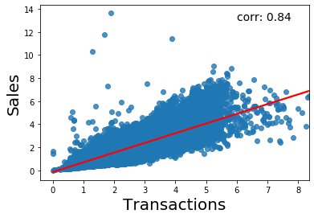


## 2. Sales of different products by promotion


```python
sql ='''
select family, sales, onpromotion from train;
'''
cur.execute(sql)
query = cur.fetchall()
sales_promotion = pd.DataFrame(query, columns=['family', 'sales', 'onpromotion'])
sales_promotion.head()
```


<div>
<style scoped>
    .dataframe tbody tr th:only-of-type {
        vertical-align: middle;
    }

    .dataframe tbody tr th {
        vertical-align: top;
    }

    .dataframe thead th {
        text-align: right;
    }
</style>
<table border="1" class="dataframe">
  <thead>
    <tr style="text-align: right;">
      <th></th>
      <th>family</th>
      <th>sales</th>
      <th>onpromotion</th>
    </tr>
  </thead>
  <tbody>
    <tr>
      <th>0</th>
      <td>AUTOMOTIVE</td>
      <td>0.0</td>
      <td>0</td>
    </tr>
    <tr>
      <th>1</th>
      <td>BABY CARE</td>
      <td>0.0</td>
      <td>0</td>
    </tr>
    <tr>
      <th>2</th>
      <td>BEAUTY</td>
      <td>0.0</td>
      <td>0</td>
    </tr>
    <tr>
      <th>3</th>
      <td>BEVERAGES</td>
      <td>0.0</td>
      <td>0</td>
    </tr>
    <tr>
      <th>4</th>
      <td>BOOKS</td>
      <td>0.0</td>
      <td>0</td>
    </tr>
  </tbody>
</table>
</div>


```python
fig, axes = plt.subplots(7, 5, figsize = (20, 20))

for i, product in enumerate(np.unique(sales_promotion.family)):
    temp = sales_promotion[sales_promotion.family == product]
    temp.plot.scatter(x = "onpromotion", y = "sales", ax=axes[int(i/5)][i%5])
    this_corr = round(temp['sales'].corr(temp['onpromotion'], method='kendall'), 3)
    axes[int(i/5)][i%5].set_title("{} \n r = {}".format(product, this_corr))

plt.tight_layout(pad=5)
plt.suptitle("Daily Number of Items On Promotion vs Family Sales \n", fontsize = 20)
plt.show()
```


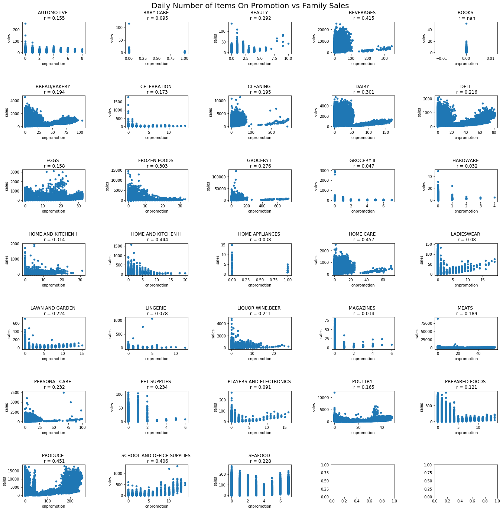


## 3. Locations

Analyses of this section is detailed in the write-up.


```python
sql ='''
select t.date, t.store_nbr, city, state, type, cluster, onpromotion, transactions
from transactions t inner join store_train s on t.store_nbr=s.store_nbr and t.date = s.date;
'''
cur.execute(sql)
query = cur.fetchall()
store_promotion = pd.DataFrame(query, columns=['date', 'store_nbr', 'city','state','type','cluster','onpromotion', 'transactions'])
store_promotion.head()
```


<div>
<style scoped>
    .dataframe tbody tr th:only-of-type {
        vertical-align: middle;
    }

    .dataframe tbody tr th {
        vertical-align: top;
    }

    .dataframe thead th {
        text-align: right;
    }
</style>
<table border="1" class="dataframe">
  <thead>
    <tr style="text-align: right;">
      <th></th>
      <th>date</th>
      <th>store_nbr</th>
      <th>city</th>
      <th>state</th>
      <th>type</th>
      <th>cluster</th>
      <th>onpromotion</th>
      <th>transactions</th>
    </tr>
  </thead>
  <tbody>
    <tr>
      <th>0</th>
      <td>2013-01-01</td>
      <td>25</td>
      <td>Salinas</td>
      <td>Santa Elena</td>
      <td>D</td>
      <td>1</td>
      <td>0</td>
      <td>770</td>
    </tr>
    <tr>
      <th>1</th>
      <td>2013-01-02</td>
      <td>1</td>
      <td>Quito</td>
      <td>Pichincha</td>
      <td>D</td>
      <td>13</td>
      <td>0</td>
      <td>2111</td>
    </tr>
    <tr>
      <th>2</th>
      <td>2013-01-02</td>
      <td>10</td>
      <td>Quito</td>
      <td>Pichincha</td>
      <td>C</td>
      <td>15</td>
      <td>0</td>
      <td>1293</td>
    </tr>
    <tr>
      <th>3</th>
      <td>2013-01-02</td>
      <td>11</td>
      <td>Cayambe</td>
      <td>Pichincha</td>
      <td>B</td>
      <td>6</td>
      <td>0</td>
      <td>3547</td>
    </tr>
    <tr>
      <th>4</th>
      <td>2013-01-02</td>
      <td>12</td>
      <td>Latacunga</td>
      <td>Cotopaxi</td>
      <td>C</td>
      <td>15</td>
      <td>0</td>
      <td>1362</td>
    </tr>
  </tbody>
</table>
</div>


```python
global_mean = store_promotion.transactions.mean()
```

#### City


```python
fig, axes = plt.subplots(5, 5, figsize = (20, 20))

for i, city in enumerate(np.unique(store_promotion.city)):
    temp = store_promotion[store_promotion.city == city]
    temp.plot.scatter(x = "onpromotion", y = "transactions", ax=axes[int(i/5)][i%5])
    n = len(temp)
    axes[int(i/5)][i%5].set_title("{} \n n = {}".format(city, n))
    axes[int(i/5)][i%5].set_ylabel("Transactions (units)", fontsize = 12)
    axes[int(i/5)][i%5].set_xlabel("Onpromotion (items)", fontsize = 12)

plt.tight_layout(pad=5)
plt.suptitle("Daily Number of Items On Promotion vs Transactions by City\n", fontsize = 20)
plt.show()
```


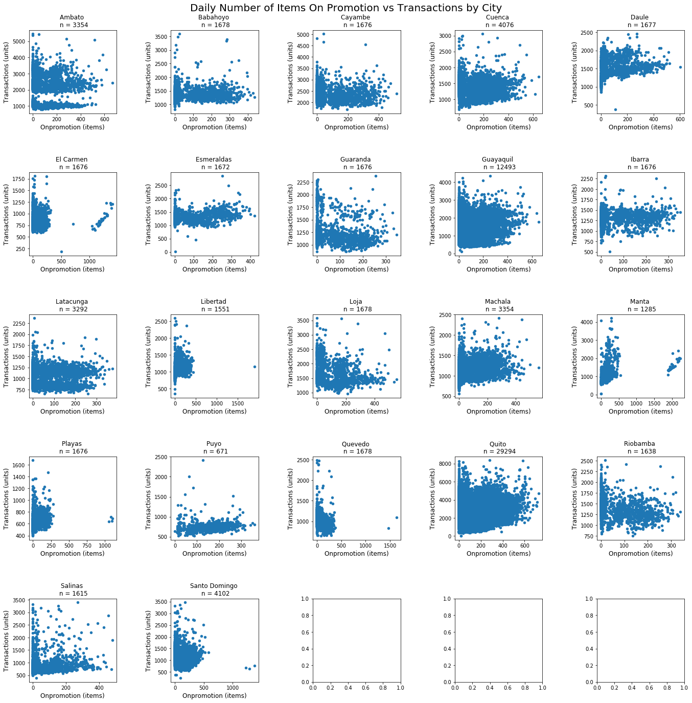


#### State


```python
fig, axes = plt.subplots(4, 4, figsize = (15, 15))

for i, state in enumerate(np.unique(store_promotion.state)):
    temp = store_promotion[store_promotion.state == state]
    temp.plot.scatter(x = "onpromotion", y = "transactions", ax=axes[int(i/4)][i%4])
    n = len(temp)
    axes[int(i/4)][i%4].set_title("{} \n n = {}".format(state, n))
    axes[int(i/4)][i%4].set_ylabel("Transactions (units)", fontsize = 12)
    axes[int(i/4)][i%4].set_xlabel("Onpromotion (items)", fontsize = 12)

plt.tight_layout(pad=5)
plt.suptitle("Daily Number of Items On Promotion vs Transactions by State\n", fontsize = 20)
plt.show()
```


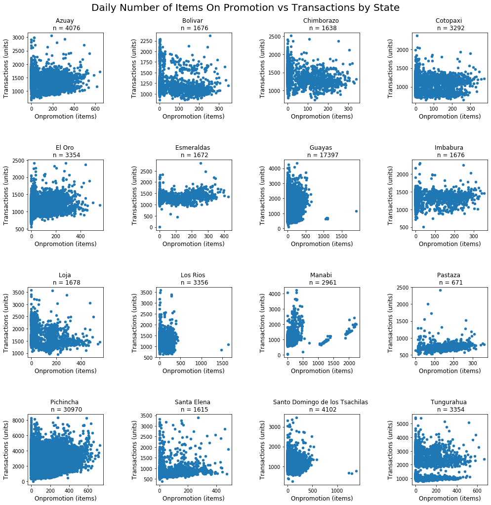


#### Store types


```python
fig, axes = plt.subplots(1, 5, figsize = (20, 5))

for i, type in enumerate(np.unique(store_promotion.type)):
    temp = store_promotion[store_promotion.type == type]
    temp.plot.scatter(x = "onpromotion", y = "transactions", ax=axes[i])
    n = len(temp)
    axes[i].set_title("{} \n n = {}".format(type, n))
    axes[i].set_ylabel("Transactions (units)", fontsize = 12)
    axes[i].set_xlabel("Onpromotion (items)", fontsize = 12)

plt.tight_layout(pad=5)
plt.suptitle("Daily Number of Items On Promotion vs Transactions By Store Types \n", fontsize = 20)
plt.show()

```


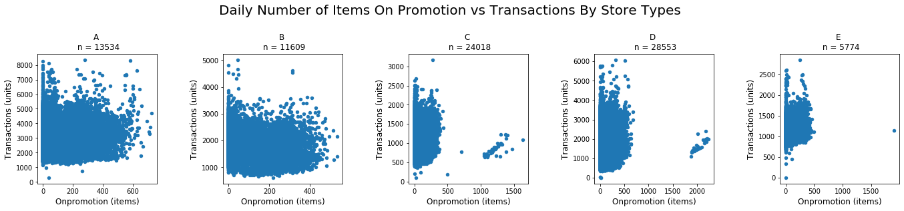


#### Cluster


```python
fig, axes = plt.subplots(4, 5, figsize = (20, 15))

for i, cluster in enumerate(np.unique(store_promotion.cluster)):
    temp = store_promotion[store_promotion.cluster == cluster]
    temp.plot.scatter(x = "onpromotion", y = "transactions", ax=axes[int(i/5)][i%5])
    n = len(temp)
    axes[int(i/5)][i%5].set_title("{} \n n = {}".format(cluster, n))
    axes[int(i/5)][i%5].set_ylabel("Transactions (units)", fontsize = 12)
    axes[int(i/5)][i%5].set_xlabel("Onpromotion (items)", fontsize = 12)

plt.tight_layout(pad=5)
plt.suptitle("Daily Number of Items On Promotion vs Transactions by Cluster \n", fontsize = 20)
plt.show()
```


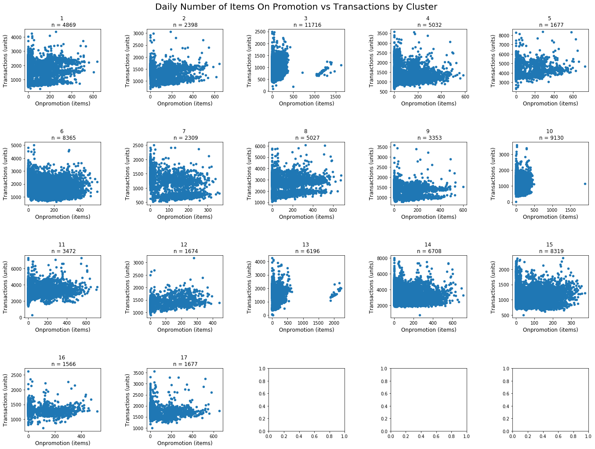


#### a. Cluster 3 and 13


```python
# comparing the means between these 2 clusters
small_cluster = store_promotion[(store_promotion.cluster == 3) | (store_promotion.cluster == 13)]
sns.kdeplot(small_cluster[small_cluster.onpromotion >= 500]['transactions'], color = 'black')
sns.kdeplot(small_cluster[small_cluster.onpromotion < 500]['transactions'], color='blue')
plt.title("Number of Transactions of Cluster 3 and 13")
plt.axvline(x = small_cluster[small_cluster.onpromotion >= 500].transactions.mean(), linestyle = '--', color='black', label='larger than 500 \n n = {}'.format(
    len(small_cluster[small_cluster.onpromotion >= 500]['transactions'])
))
plt.axvline(x = small_cluster[small_cluster.onpromotion < 500].transactions.mean(), linestyle = '-', color='blue', label='smaller than 500 \n n = {}'.format(
    len(small_cluster[small_cluster.onpromotion < 500]['transactions'])
))
plt.legend()
plt.show()
```


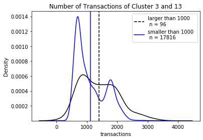


#### b. Cities El Carmen, Manta, Playas, Santo Domingo and Quevedo


```python
# narrow down the scope and comparing the means between these 3 cities
city_cluster = store_promotion[(store_promotion.city == 'El Carmen') | (store_promotion.city == 'Manta') | (store_promotion.city == 'Playas') | (store_promotion.city == 'Santo Domingo') | (store_promotion.city == 'Quevedo')]
sns.kdeplot(city_cluster[city_cluster.onpromotion >= 500]['transactions'], color = 'black')
sns.kdeplot(city_cluster[city_cluster.onpromotion < 500]['transactions'], color='blue')
plt.title("Number of Transactions of El Carmen, Manta, Playas, \n Santo Domingo and Quevedo")
plt.axvline(x = city_cluster[city_cluster.onpromotion >= 500].transactions.mean(), linestyle = '--', color='black', label='larger than 500 \n n = {}'.format(
    len(city_cluster[city_cluster.onpromotion >= 500]['transactions'])
))
plt.axvline(x = city_cluster[city_cluster.onpromotion < 500].transactions.mean(), linestyle = '-', color='blue', label='smaller than 500 \n n = {}'.format(
    len(city_cluster[city_cluster.onpromotion < 500]['transactions'])
))
plt.legend()
plt.show()
```


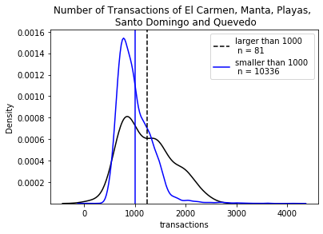


There are certain differences in the two distribution, but we don't know if it's indicative and significant, especially when the datasize is really small here.

## 4. Is there more promotions if oil prices rise?

In this section, we want to see how daily oil prices move along with the number of promotions. The data of oil prices are not continuous (some days without data). In order to merge the two dataframes and plot the time series, we need them to share the same equally spaced, daily time range, so preprcoessing the time frame is a big step in this section. NaN values are interpolated and shown on the graph.


```python
oil_data = pd.read_csv('oil.csv')
oil_data.date = pd.to_datetime(oil_data.date)
oil_data.head()
```


<div>
<style scoped>
    .dataframe tbody tr th:only-of-type {
        vertical-align: middle;
    }

    .dataframe tbody tr th {
        vertical-align: top;
    }

    .dataframe thead th {
        text-align: right;
    }
</style>
<table border="1" class="dataframe">
  <thead>
    <tr style="text-align: right;">
      <th></th>
      <th>date</th>
      <th>dcoilwtico</th>
    </tr>
  </thead>
  <tbody>
    <tr>
      <th>0</th>
      <td>2013-01-01</td>
      <td>NaN</td>
    </tr>
    <tr>
      <th>1</th>
      <td>2013-01-02</td>
      <td>93.14</td>
    </tr>
    <tr>
      <th>2</th>
      <td>2013-01-03</td>
      <td>92.97</td>
    </tr>
    <tr>
      <th>3</th>
      <td>2013-01-04</td>
      <td>93.12</td>
    </tr>
    <tr>
      <th>4</th>
      <td>2013-01-07</td>
      <td>93.20</td>
    </tr>
  </tbody>
</table>
</div>


```python
sql = "SELECT date, sum(onpromotion) as onpromotion, avg(sales) as sales FROM train GROUP BY date"
cur.execute(sql)
query = cur.fetchall()
monthly_transactions_sales = pd.DataFrame(query, columns=['date', "onpromotion", "sales"])
monthly_transactions_sales.date = pd.to_datetime(monthly_transactions_sales.date)
monthly_transactions_sales.head()
```


<div>
<style scoped>
    .dataframe tbody tr th:only-of-type {
        vertical-align: middle;
    }

    .dataframe tbody tr th {
        vertical-align: top;
    }

    .dataframe thead th {
        text-align: right;
    }
</style>
<table border="1" class="dataframe">
  <thead>
    <tr style="text-align: right;">
      <th></th>
      <th>date</th>
      <th>onpromotion</th>
      <th>sales</th>
    </tr>
  </thead>
  <tbody>
    <tr>
      <th>0</th>
      <td>2013-01-01</td>
      <td>0</td>
      <td>1.409438</td>
    </tr>
    <tr>
      <th>1</th>
      <td>2013-01-02</td>
      <td>0</td>
      <td>278.390807</td>
    </tr>
    <tr>
      <th>2</th>
      <td>2013-01-03</td>
      <td>0</td>
      <td>202.840197</td>
    </tr>
    <tr>
      <th>3</th>
      <td>2013-01-04</td>
      <td>0</td>
      <td>198.911154</td>
    </tr>
    <tr>
      <th>4</th>
      <td>2013-01-05</td>
      <td>0</td>
      <td>267.873244</td>
    </tr>
  </tbody>
</table>
</div>


```python
# create continuous date for the data
continuous_date = pd.DataFrame(pd.date_range(start='1/1/2013', end='15/08/2017'), columns=['date'])
oil_transactions = continuous_date.merge(monthly_transactions_sales, how='left', on='date')
oil_transactions = oil_transactions.merge(oil_data, how='left', on='date')
```


```python
# interpolate NaN to fill in the gaps in the graph
oil_transactions['dcoilwtico_interpolate'] = oil_transactions.dcoilwtico.interpolate()
oil_transactions.onpromotion = oil_transactions.onpromotion.astype('float')
oil_transactions.head()
```


<div>
<style scoped>
    .dataframe tbody tr th:only-of-type {
        vertical-align: middle;
    }

    .dataframe tbody tr th {
        vertical-align: top;
    }

    .dataframe thead th {
        text-align: right;
    }
</style>
<table border="1" class="dataframe">
  <thead>
    <tr style="text-align: right;">
      <th></th>
      <th>date</th>
      <th>onpromotion</th>
      <th>sales</th>
      <th>dcoilwtico</th>
      <th>dcoilwtico_interpolate</th>
    </tr>
  </thead>
  <tbody>
    <tr>
      <th>0</th>
      <td>2013-01-01</td>
      <td>0.0</td>
      <td>1.409438</td>
      <td>NaN</td>
      <td>NaN</td>
    </tr>
    <tr>
      <th>1</th>
      <td>2013-01-02</td>
      <td>0.0</td>
      <td>278.390807</td>
      <td>93.14</td>
      <td>93.140000</td>
    </tr>
    <tr>
      <th>2</th>
      <td>2013-01-03</td>
      <td>0.0</td>
      <td>202.840197</td>
      <td>92.97</td>
      <td>92.970000</td>
    </tr>
    <tr>
      <th>3</th>
      <td>2013-01-04</td>
      <td>0.0</td>
      <td>198.911154</td>
      <td>93.12</td>
      <td>93.120000</td>
    </tr>
    <tr>
      <th>4</th>
      <td>2013-01-05</td>
      <td>0.0</td>
      <td>267.873244</td>
      <td>NaN</td>
      <td>93.146667</td>
    </tr>
  </tbody>
</table>
</div>


```python
fig, ax = plt.subplots(figsize = (15, 5))
oil_transactions.plot(ax = ax, x = 'date', y = 'dcoilwtico_interpolate',  color = 'black')
oil_transactions.plot(ax = ax, x = 'date', y = 'dcoilwtico')
oil_transactions.plot(ax = ax, x = 'date', y = 'onpromotion', secondary_y=True, ylabel = 'Oil prices', alpha = 0.6)
plt.title('Oil prices and daily total number of items on sale')
plt.ylabel("Number of items on sale")
plt.show()
```


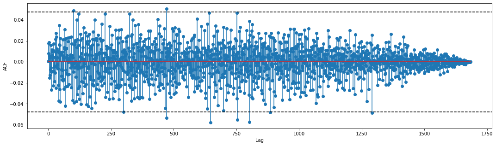


```python
# measuring the cross correlation between oil price and sales
import statsmodels.tsa.stattools as smt
x = oil_transactions['sales'].interpolate()[1:]
y = oil_transactions['dcoilwtico_interpolate'].interpolate()[1:]

# to conduct ccf, x and y have to be stationary
# stationarity for x
n_adf = pmd.arima.ndiffs(x, test="adf")
n_kpss = pmd.arima.ndiffs(x, test="kpss")
n_diff = max(n_adf, n_kpss)  
x_diff = x.diff(n_diff)[1:]

# stationarity for y
n_adf = pmd.arima.ndiffs(y, test="adf")
n_kpss = pmd.arima.ndiffs(y, test="kpss")
n_diff = max(n_adf, n_kpss)  
y_diff = y.diff(n_diff)[1:]

forwards = smt.ccf(x_diff, y_diff, adjusted=False)
plt.figure(figsize=(18, 5))
plt.stem(range(0, len(forwards)), forwards)
plt.xlabel('Lag')
plt.ylabel('ACF')
# 95% UCL / LCL
plt.axhline(-1.96/np.sqrt(len(x)), color='k', ls='--') 
plt.axhline(1.96/np.sqrt(len(x)), color='k', ls='--');
```


The result shows us that many lags near lag 0 are significant/have moderately strong correlation, and this correlation eases off as we move further away. This indicates that the oil prices at small lags correlate with sales. More specifically, it suggests that the oil prices affect sales of certain days later, which makes sense since oil prices affect how people buy and sell.

## 5. Are promotions effective? <a class="anchor" id="5-are-promotions-effective"></a>
In order to examine the effect of promotion, I narrowed the scope of analysis down to the most granular level possible. This will eliminate the effect of other variables not of interest (different stores, different products, different cities). I started off by filtering out sales of Grocery I from store 1 in Quito to see if the analysis is possible/interesting enough to pursue. Using traditional methods of analyzing time series, I investigated trend and seasonality in the dataset, then I handpicked the parameters for my SARIMAX model accordingly. auto_arima() is used to cross-check the results, making sure the discrepancy in the parameters is not too substantial.

After that, I went on to fit auto_arima to all the combinations of store-city-product and select those combinations that yield significant p-values. These are the cases where promotions have an positive effect on sales.

  * [5.1 Checking the condition](#1-checking-the-conditions)
  * [5.2 Examine one SARIMAX model](#2-fit-sarimax-model)
  * [5.3 Promotion on sales of all products](#3-promotion-impact-on-sales-of-all-products)
  * [5.4 Analysis of the results](#4-analysis-of-the-results)

(Note for bugs and potential problems)

#### Getting and wrangling the data


```python
# take since 2015 because the pattern is similar and repeated
sql ='''
select date, train.store_nbr, family,city, sales, onpromotion from train
inner join stores using(store_nbr) where year(date) >= 2015;
'''
cur.execute(sql)
query = cur.fetchall()
main = pd.DataFrame(query, columns=['date', 'store_nbr','family','city', 'sales', 'onpromotion'])
main.date = pd.to_datetime(main.date)
main.head()
```


<div>
<style scoped>
    .dataframe tbody tr th:only-of-type {
        vertical-align: middle;
    }

    .dataframe tbody tr th {
        vertical-align: top;
    }

    .dataframe thead th {
        text-align: right;
    }
</style>
<table border="1" class="dataframe">
  <thead>
    <tr style="text-align: right;">
      <th></th>
      <th>date</th>
      <th>store_nbr</th>
      <th>family</th>
      <th>city</th>
      <th>sales</th>
      <th>onpromotion</th>
    </tr>
  </thead>
  <tbody>
    <tr>
      <th>0</th>
      <td>2015-01-01</td>
      <td>1</td>
      <td>AUTOMOTIVE</td>
      <td>Quito</td>
      <td>0.0</td>
      <td>0</td>
    </tr>
    <tr>
      <th>1</th>
      <td>2015-01-01</td>
      <td>1</td>
      <td>BABY CARE</td>
      <td>Quito</td>
      <td>0.0</td>
      <td>0</td>
    </tr>
    <tr>
      <th>2</th>
      <td>2015-01-01</td>
      <td>1</td>
      <td>BEAUTY</td>
      <td>Quito</td>
      <td>0.0</td>
      <td>0</td>
    </tr>
    <tr>
      <th>3</th>
      <td>2015-01-01</td>
      <td>1</td>
      <td>BEVERAGES</td>
      <td>Quito</td>
      <td>0.0</td>
      <td>0</td>
    </tr>
    <tr>
      <th>4</th>
      <td>2015-01-01</td>
      <td>1</td>
      <td>BOOKS</td>
      <td>Quito</td>
      <td>0.0</td>
      <td>0</td>
    </tr>
  </tbody>
</table>
</div>


```python
# investigate at the highest granularity level: at store 1, grocery I family, in Quito
granular_df = main[(main.city == 'Quito') & (main.family == 'GROCERY I') & (main.store_nbr == 1)]
granular_df.reset_index(inplace = True, drop = True)
print("Total sample size is: ", len(granular_df))
print(granular_df.head())
```

    Total sample size is:  956
            date  store_nbr     family   city   sales  onpromotion
    0 2015-01-01          1  GROCERY I  Quito     0.0            0
    1 2015-01-02          1  GROCERY I  Quito  1418.0            9
    2 2015-01-03          1  GROCERY I  Quito  1869.0            9
    3 2015-01-04          1  GROCERY I  Quito  1020.0           19
    4 2015-01-05          1  GROCERY I  Quito  2914.0           16


```python
# create a column to indicate whether the family product is on promotion OR not
granular_df['bool_promotion'] = [0 if x == 0 else 1 for x in granular_df.onpromotion]

# create continuous date for the data
continuous_date = pd.DataFrame(pd.date_range(start='1/1/2015', end='15/08/2017'), columns=['date'])
continuous_date = continuous_date.merge(granular_df, how='left', on='date')
continuous_date.drop(['store_nbr', 'city', 'family'], axis=1, inplace=True)

# cleaning up the missing values
continuous_date.sales = continuous_date.sales.fillna(0)
continuous_date.onpromotion = continuous_date.onpromotion.fillna(0)
continuous_date.bool_promotion = continuous_date.bool_promotion.fillna(0)

continuous_date.isnull().sum()
```


    date              0
    sales             0
    onpromotion       0
    bool_promotion    0
    dtype: int64


```python
continuous_date.bool_promotion.value_counts()
```


    1.0    938
    0.0     20
    Name: bool_promotion, dtype: int64


```python
continuous_date.set_index('date', inplace = True)
```

#### Visualize this subset of data


```python
# visually check the relationship
sns.boxplot(continuous_date['bool_promotion'], continuous_date['sales'])
plt.title("Sales by promotion/no promotion")
plt.xlabel("Promotion")
locs, labels = plt.xticks()
labels = ['No', 'Yes']
plt.xticks(locs, labels)
plt.ylabel("Sales (units)")
plt.show()
```


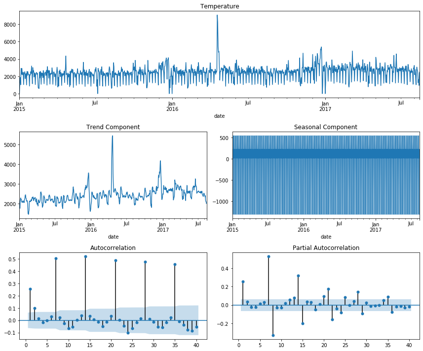


```python
from statsmodels.tsa.seasonal import seasonal_decompose
from statsmodels.graphics.tsaplots import plot_acf, plot_pacf

def plot_stationarity(y, lags):
   
    y = pd.Series(y)

    # decompose the time series into trend, seasonality and residuals
    decomp = seasonal_decompose(y)
    trend = decomp.trend
    seas = decomp.seasonal
   

    fig = plt.figure()
    fig.set_figheight(10)
    fig.set_figwidth(18)
    

    ax1 = plt.subplot2grid((3, 3), (0, 0), colspan=2)
    ax2 = plt.subplot2grid((3, 3), (1, 0))
    ax3 = plt.subplot2grid((3, 3), (1, 1))
    ax5 = plt.subplot2grid((3, 3), (2, 0))
    ax6 = plt.subplot2grid((3, 3), (2, 1))

    y.plot(ax=ax1)
    ax1.set_title("Temperature")

    trend.plot(ax=ax2)
    ax2.set_title("Trend Component")

    seas.plot(ax=ax3)
    ax3.set_title("Seasonal Component")
    
    plot_acf(y, lags=lags, zero=False, ax=ax5);
    plot_pacf(y, lags=lags, zero=False, ax=ax6);

    plt.tight_layout()

plot_stationarity(continuous_date['sales'], 40)
```


Mean is not constant and acf plot shows seasonality at lag 7

### 1. Checking the conditions

#### Stationarity diagnostics


```python
# checking stationarity
from statsmodels.tsa.stattools import adfuller, kpss

# ADF Test
# null hypothesis: There is a unit root and the series is NOT stationary 
def ADF_statt(x):
    adf_test = adfuller(x, autolag="aic")
    t_stat, p_value, _, _, _, _  = adf_test
    conclusion = "non-stationary (unit root)" if p_value > 0.05 else "stationary"
    res_dict = {"ADF statistic":t_stat, "p-value":p_value, "should we difference?": (p_value > 0.05), "conclusion": conclusion}
    return res_dict


# call the ADF test:
resADF = ADF_statt(continuous_date.sales)

# KPSS Test
# null hypothesis: There series is (at least trend-)stationary 
def KPSS_statt(x):
    kpss_test = kpss(x)
    t_stat, p_value, _, critical_values  = kpss_test
    conclusion = "stationary" if p_value > 0.05 else "not stationary"
    res_dict = {"KPSS statistic":t_stat, "p-value":p_value, "should we difference?": (p_value < 0.05), "conclusion": conclusion}
    return res_dict


# call the KPSS test:
resKPSS = KPSS_statt(continuous_date.sales)
```

    /opt/anaconda3/lib/python3.7/site-packages/statsmodels/tsa/stattools.py:1661: FutureWarning: The behavior of using lags=None will change in the next release. Currently lags=None is the same as lags='legacy', and so a sample-size lag length is used. After the next release, the default will change to be the same as lags='auto' which uses an automatic lag length selection method. To silence this warning, either use 'auto' or 'legacy'
      warn(msg, FutureWarning)
    /opt/anaconda3/lib/python3.7/site-packages/statsmodels/tsa/stattools.py:1685: InterpolationWarning: p-value is smaller than the indicated p-value
      warn("p-value is smaller than the indicated p-value", InterpolationWarning)


```python
# compare ADF and KPSS result
test_values = zip(resADF.values(), resKPSS.values())
dict_tests = dict(zip(resADF.keys(), test_values))
df_tests = pd.DataFrame().from_dict(dict_tests).transpose()
df_tests.columns = ["ADF", "KPSS"]
print("Stationarity Tests for original data, before differencing:")
df_tests
```

    Stationarity Tests for original data, before differencing:


<div>
<style scoped>
    .dataframe tbody tr th:only-of-type {
        vertical-align: middle;
    }

    .dataframe tbody tr th {
        vertical-align: top;
    }

    .dataframe thead th {
        text-align: right;
    }
</style>
<table border="1" class="dataframe">
  <thead>
    <tr style="text-align: right;">
      <th></th>
      <th>ADF</th>
      <th>KPSS</th>
    </tr>
  </thead>
  <tbody>
    <tr>
      <th>ADF statistic</th>
      <td>-4.302511</td>
      <td>1.648345</td>
    </tr>
    <tr>
      <th>p-value</th>
      <td>0.00044</td>
      <td>0.01</td>
    </tr>
    <tr>
      <th>should we difference?</th>
      <td>False</td>
      <td>True</td>
    </tr>
    <tr>
      <th>conclusion</th>
      <td>stationary</td>
      <td>not stationary</td>
    </tr>
  </tbody>
</table>
</div>


#### First differencing -- eliminate trend and restore stationarity


```python
# pmdarima also offers methods that suggest the order of first differencing, based on either ADF or the KPSS test
n_adf = pmd.arima.ndiffs(continuous_date.sales, test="adf")
n_kpss = pmd.arima.ndiffs(continuous_date.sales, test="kpss")
n_diffs = {"ADF ndiff":n_adf, "KPSS ndiff":n_kpss}
print("recommended order of first differencing for original data:")
[print(key, ":", value) for key,value in n_diffs.items()]
```

    recommended order of first differencing for original data:
    ADF ndiff : 0
    KPSS ndiff : 1


    [None, None]


```python
# differencing following the diagnostics

# ADF and KPSS tests after differencing:

n_diff = max(n_adf, n_kpss)   
df_diff1 = continuous_date.diff(n_diff).dropna()['sales']

resADF = ADF_statt(df_diff1)
resKPSS = KPSS_statt(df_diff1)
test_values = zip(resADF.values(), resKPSS.values())
dict_tests = dict(zip(resADF.keys(), test_values))
df_tests = pd.DataFrame().from_dict(dict_tests).transpose()
df_tests.columns = ["ADF", "KPSS"]

print("Stationary after 1 round of first-differencing?")
df_tests
```

    Stationary after 1 round of first-differencing?


    /opt/anaconda3/lib/python3.7/site-packages/statsmodels/tsa/stattools.py:1661: FutureWarning: The behavior of using lags=None will change in the next release. Currently lags=None is the same as lags='legacy', and so a sample-size lag length is used. After the next release, the default will change to be the same as lags='auto' which uses an automatic lag length selection method. To silence this warning, either use 'auto' or 'legacy'
      warn(msg, FutureWarning)
    /opt/anaconda3/lib/python3.7/site-packages/statsmodels/tsa/stattools.py:1687: InterpolationWarning: p-value is greater than the indicated p-value
      warn("p-value is greater than the indicated p-value", InterpolationWarning)


<div>
<style scoped>
    .dataframe tbody tr th:only-of-type {
        vertical-align: middle;
    }

    .dataframe tbody tr th {
        vertical-align: top;
    }

    .dataframe thead th {
        text-align: right;
    }
</style>
<table border="1" class="dataframe">
  <thead>
    <tr style="text-align: right;">
      <th></th>
      <th>ADF</th>
      <th>KPSS</th>
    </tr>
  </thead>
  <tbody>
    <tr>
      <th>ADF statistic</th>
      <td>-10.625869</td>
      <td>0.036404</td>
    </tr>
    <tr>
      <th>p-value</th>
      <td>0.0</td>
      <td>0.1</td>
    </tr>
    <tr>
      <th>should we difference?</th>
      <td>False</td>
      <td>False</td>
    </tr>
    <tr>
      <th>conclusion</th>
      <td>stationary</td>
      <td>stationary</td>
    </tr>
  </tbody>
</table>
</div>


```python
plot_stationarity(df_diff1, 40)
```


However, after the first difference, we can see that the autocorrelation plunges right to big negative values, which implies that we are over-differencing. Hence, I'll just leave it as is. We do notice that there is a significant seasonal component of this time series, which we are going to handle next.

#### Seasonal differencing


```python
# difference the original series with a seasonal period of 7
seasonal_diff = continuous_date.diff(7).dropna()['sales']

# check to see if the differenced series are stationary
resADF2 = ADF_statt(seasonal_diff)
resKPSS2 = KPSS_statt(seasonal_diff)
test_values2 = zip(resADF2.values(), resKPSS2.values())
dict_tests2 = dict(zip(resADF2.keys(), test_values2))
df_tests2 = pd.DataFrame().from_dict(dict_tests2).transpose()
df_tests2.columns = ["ADF", "KPSS"]

df_tests2
```

    /opt/anaconda3/lib/python3.7/site-packages/statsmodels/tsa/stattools.py:1661: FutureWarning: The behavior of using lags=None will change in the next release. Currently lags=None is the same as lags='legacy', and so a sample-size lag length is used. After the next release, the default will change to be the same as lags='auto' which uses an automatic lag length selection method. To silence this warning, either use 'auto' or 'legacy'
      warn(msg, FutureWarning)
    /opt/anaconda3/lib/python3.7/site-packages/statsmodels/tsa/stattools.py:1687: InterpolationWarning: p-value is greater than the indicated p-value
      warn("p-value is greater than the indicated p-value", InterpolationWarning)


<div>
<style scoped>
    .dataframe tbody tr th:only-of-type {
        vertical-align: middle;
    }

    .dataframe tbody tr th {
        vertical-align: top;
    }

    .dataframe thead th {
        text-align: right;
    }
</style>
<table border="1" class="dataframe">
  <thead>
    <tr style="text-align: right;">
      <th></th>
      <th>ADF</th>
      <th>KPSS</th>
    </tr>
  </thead>
  <tbody>
    <tr>
      <th>ADF statistic</th>
      <td>-9.161831</td>
      <td>0.040939</td>
    </tr>
    <tr>
      <th>p-value</th>
      <td>0.0</td>
      <td>0.1</td>
    </tr>
    <tr>
      <th>should we difference?</th>
      <td>False</td>
      <td>False</td>
    </tr>
    <tr>
      <th>conclusion</th>
      <td>stationary</td>
      <td>stationary</td>
    </tr>
  </tbody>
</table>
</div>


```python
plot_stationarity(seasonal_diff, 40)
```


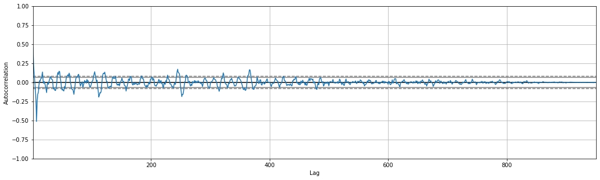


```python
# check if seasonal differencing is effective -- should have decreasing flunctuation
from pandas.plotting import autocorrelation_plot
plt.figure(figsize=(18, 5))
autocorrelation_plot(seasonal_diff.tolist());
```


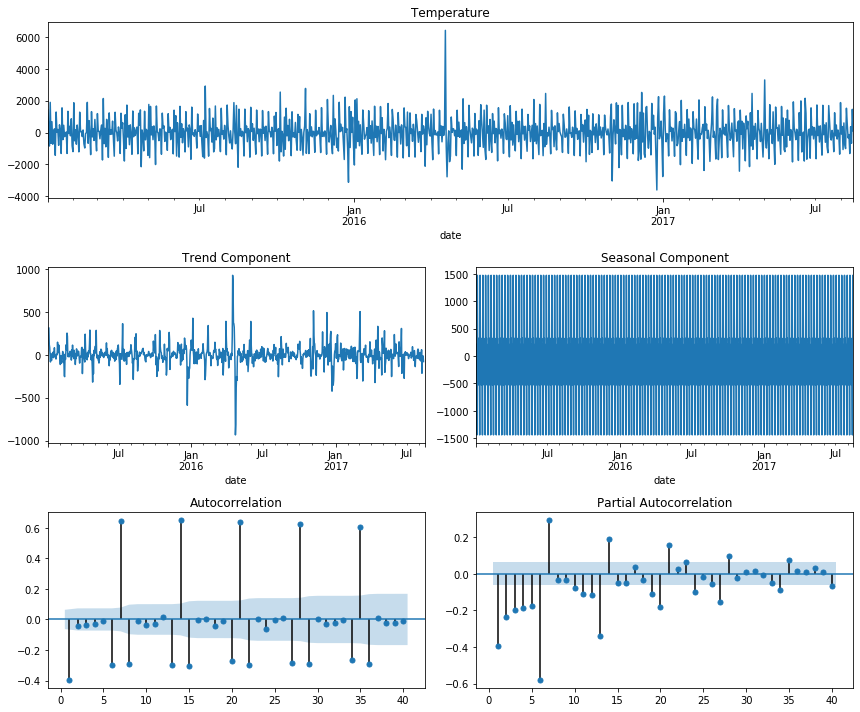


### 2. Fit SARIMAX model

From the seasonal differenced PACF and PACF plot, I'm going to choose p = 1, q = 2. And as we've seen, d = 0

For the seasonal order, we used seasonal differencing for the dataset, so D = 1, s = 7 since the data shows weekly periods. I'm going to set P = 1 and Q = 1 (PACF decays more gradual) for now -- what should be chosen here...

#### Fitting the model by estimating the parameters from the graphs


```python
model = SARIMAX(continuous_date.sales, exog=continuous_date.bool_promotion, order=(1,0,2), seasonal_order=(1,1,1,7), enforce_invertibility=False, enforce_stationarity=False).fit(max_iter=50, method='powell')
print(model.summary())
```

    /opt/anaconda3/lib/python3.7/site-packages/statsmodels/tsa/base/tsa_model.py:162: ValueWarning: No frequency information was provided, so inferred frequency D will be used.
      % freq, ValueWarning)
    /opt/anaconda3/lib/python3.7/site-packages/statsmodels/tsa/base/tsa_model.py:162: ValueWarning: No frequency information was provided, so inferred frequency D will be used.
      % freq, ValueWarning)


    Optimization terminated successfully.
             Current function value: 7.542775
             Iterations: 3
             Function evaluations: 260
                                          SARIMAX Results                                      
    ===========================================================================================
    Dep. Variable:                               sales   No. Observations:                  958
    Model:             SARIMAX(1, 0, 2)x(1, 1, [1], 7)   Log Likelihood               -7225.979
    Date:                             Sat, 22 Jan 2022   AIC                          14465.957
    Time:                                     20:20:30   BIC                          14499.886
    Sample:                                 01-01-2015   HQIC                         14478.891
                                          - 08-15-2017                                         
    Covariance Type:                               opg                                         
    ==================================================================================
                         coef    std err          z      P>|z|      [0.025      0.975]
    ----------------------------------------------------------------------------------
    bool_promotion   560.7710     71.187      7.877      0.000     421.246     700.296
    ar.L1              0.6567      0.069      9.579      0.000       0.522       0.791
    ma.L1             -0.1786      0.069     -2.588      0.010      -0.314      -0.043
    ma.L2             -0.0665      0.056     -1.188      0.235      -0.176       0.043
    ar.S.L7           -0.0174      0.030     -0.584      0.559      -0.076       0.041
    ma.S.L7           -0.9616      0.012    -83.607      0.000      -0.984      -0.939
    sigma2           2.84e+05   4651.920     61.041      0.000    2.75e+05    2.93e+05
    ===================================================================================
    Ljung-Box (Q):                       42.13   Jarque-Bera (JB):             17075.12
    Prob(Q):                              0.38   Prob(JB):                         0.00
    Heteroskedasticity (H):               1.89   Skew:                             1.31
    Prob(H) (two-sided):                  0.00   Kurtosis:                        23.70
    ===================================================================================
    
    Warnings:
    [1] Covariance matrix calculated using the outer product of gradients (complex-step).


```python
pd.plotting.register_matplotlib_converters()
model.plot_diagnostics(figsize=(14, 10))
plt.show()
```


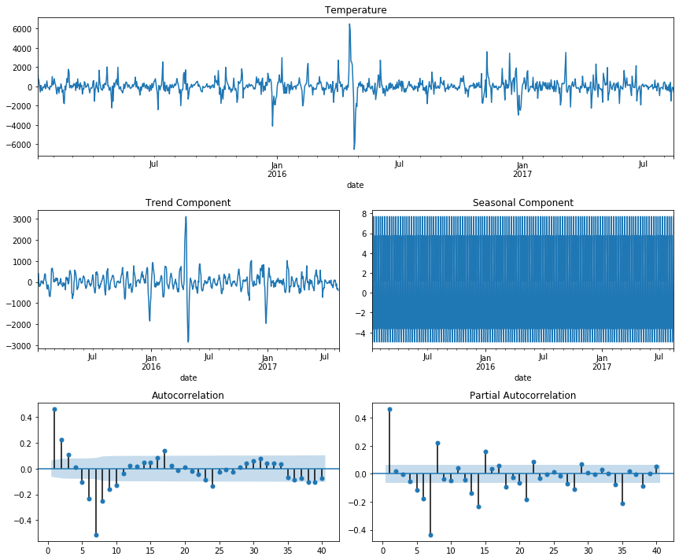


```python
pred = model.get_prediction(start=pd.to_datetime('2017-05-01'), dynamic=False, exog = continuous_date['bool_promotion'])
pred_ci = pred.conf_int()
```

    /opt/anaconda3/lib/python3.7/site-packages/statsmodels/tsa/base/tsa_model.py:342: FutureWarning: The 'freq' argument in Timestamp is deprecated and will be removed in a future version.
      date_key = Timestamp(key, freq=base_index.freq)


```python
plt.figure(figsize=(20, 10))
plt.plot(continuous_date['2017-05-01':].index, continuous_date['2017-05-01':]['sales'], label='observed')
plt.plot(pred.predicted_mean.index,pred.predicted_mean, label='One-step ahead Forecast', alpha=.7)

plt.fill_between(pred_ci.index,
                pred_ci.iloc[:, 0],
                pred_ci.iloc[:, 1], color='k', alpha=.1)

plt.xlabel('Date')
plt.ylabel('Sales')
plt.legend()

plt.show()
```


The model performs pretty well in the diagnostics plot as well as when we use it to predict the sales of this period. Since our main goal is to get the coefficients of the model and analyze their statistical significance, this model can give us a pretty good and accurate estimates. Through this I learned that the patterns in sales here are "modelable" and I will proceed to carry out the same process for all the combinations and summarize their performance.

### 3. Promotion impact on sales of all products


```python
import pmdarima as pm
from kats.detectors.seasonality import FFTDetector

def granularize(df):
    """
    Purpose: Takes in the filtered, aggregated data and carry out pre-processing steps including: create a 
            boolean variable to indicate whether there is promotion or not, map the data to a continous date 
            range (there are missing dates in the current subset of data), handling missing values.

    Parameters: The df from create_subset()
    
    Returns: The new processed dataframe

    Note: 
        - Currently missing data is replaced with 0, can be a potential problem?
        - The boolean variable will be treated as the exogenous variable in SARIMAX model

    """
    granular_df = df
    granular_df.reset_index(inplace = True, drop = True)

    # create a column to indicate whether the family product is on promotion OR not
    granular_df['bool_promotion'] = [0 if x == 0 else 1 for x in granular_df.onpromotion]

    # create continuous date for the data
    continuous_date = pd.DataFrame(pd.date_range(start='1/1/2015', end='15/08/2017'), columns=['date'])
    continuous_date = continuous_date.merge(granular_df, how='left', on='date')

    # cleaning up the missing values -- ask question abt this
    continuous_date.sales = continuous_date.sales.fillna(0)
    continuous_date.onpromotion = continuous_date.onpromotion.fillna(0)
    continuous_date.bool_promotion = continuous_date.bool_promotion.fillna(0)

    continuous_date.set_index('date', inplace = True)
    return continuous_date


def create_subset(df, family = None, store_nbr = None, city=None):
    """
    Purpose: Takes in the original data along with the filters to generate a new dataframe of the daily sales aggregated
            on the given level. The new datafram is then passed into granularize() to be pre-processed
            before fitting the sarimax model

    Parameters: family, store_nbr, city. If a level is set to None, the df is not aggregated on that level. 
            If all is None, the daily sales will be the mean across all stores, all cities and all products.
            (Defaulted to None)
    
    Returns: The new processed dataframe

    """
    # filtering with the provided params
    if family is not None:
        df = df[df.family == family]
    if store_nbr is not None:
        df = df[df.store_nbr == store_nbr]
    if city is not None:
        df = df[df.city == city]
    
    # aggregate the daily sales and promotion
    df_new = df.groupby('date').agg({
        'onpromotion':'sum',
        'sales':'mean'}).reset_index() 
    
    return granularize(df_new)

def fit_sarimax(df):
    """
    Purpose: Fit the sarimax model

    Parameters: df—the fully processed dataframe; seasonal–whether this subset of data has seasonality or not
    
    Returns: The model of type pdarima.ARIMA

    Note: 

    """
    
    # creating a temp df to detect the seasonality period
    temp_df = df.reset_index()
    temp_df = temp_df[['date', 'sales']]
    temp_df = temp_df.rename(columns={"date": "time", "sales": "value"})
    ts = TimeSeriesData(temp_df)
    fft_detector = FFTDetector(ts)
    d = fft_detector.detector() 
    if d['seasonality_presence'] == False:
        m = 1
    elif round(min(d['seasonalities'])) > 30: # detect at most monthly pattern, discard the rest as non-seasonal (TIME + data size)
        m = 1
    else:
        m = round(min(d['seasonalities']))
    
    if m == 1:
        seasonal = False
    else:
        seasonal = True
    print(m)
    sxmodel = pm.auto_arima(df[['sales']], exogenous=df[['bool_promotion']],
                            start_p=1, start_q=1,
                            test='adf',
                            max_p=2, max_q=2, m=m,
                            start_P=0, start_Q=0, seasonal=seasonal, trace=5,
                            # error_action='ignore',  
                            # suppress_warnings=True, 
                            stepwise=True, random_state = 0)
    print("Doneeee")
    return sxmodel
```


```python
########################################################################################################
# this cell is used to generate all posible combinations of city-store-product for analysis, which is then written to a txt file for future use
# commented out because don't have to run again
# when the notebook is rerun, run the cell below to read the data in instead
########################################################################################################


# writing all the combinations to a file
from itertools import product

file_object = open('all_combinations.txt', 'a')

megalist =[list(np.unique(main['city'])), list(np.unique(main['family'])), list(np.unique(main['store_nbr']))]
# megalist 
combinations = list()
for i in list(product(*megalist)):
    if len(main[(main.city == i[0]) & (main.family == i[1]) & (main.store_nbr == i[2])]) > 0:
        combinations.append(i)
        # write output to a file
        with open("all_combinations.txt", "a+") as file_object:
            # Move read cursor to the start of file.
            file_object.seek(0)
            # If file is not empty then append '\n'
            data = file_object.read(100)
            if len(data) > 0 :
                file_object.write("\n")
            # Append text at the end of file
            file_object.write(str(i))
        
```


```python
# remove the combinations that don't exist in the main dataset
for _ in range(4):
    for i in combinations:
        h = main[(main.city == i[0]) & (main.family == i[1]) & (main.store_nbr == i[2])]
        if (len(h[h.sales != 0]) == 0) or (len(h[h.onpromotion != 0]) == 0):
            combinations.remove(i)
```


```python
##### write the filtered list of combinations into a file
# for i in combinations:
#     with open("all_combinations2.txt", "a+") as file_object:
#         # Move read cursor to the start of file.
#         file_object.seek(0)
#         # If file is not empty then append '\n'
#         data = file_object.read(100)
#         if len(data) > 0 :
#             file_object.write("\n")
#         # Append text at the end of file
#         file_object.write(str(i))

```


```python
#############################################
# read the list of combinations in from file
#############################################
combinations = list()
file_text = open('all_combinations2.txt', "r")

while True: # read till EOF
    file_line = file_text.readline()
    if not file_line:
        print("End Of File")
        break
    res = eval(file_line)
    combinations.append(res)

file_text.close()
```

    End Of File


```python
# the number of combinations remains after removing 
len(combinations)
```


    1597


```python
# fitting the sarimax model for each of the combinations, store the resulting p-values and models. 
# also writing out the progress to a file to keep track

significant_comb = list()


with open("progress.txt", "a+") as file_object:
    for num, i in enumerate(list(combinations[:1])):

        # if num % 10 == 0: # write to the file after every 50 model fits
        # Move read cursor to the start of file.
        file_object.seek(0)
        # If file is not empty then append '\n'
        data = file_object.read(100)
        if len(data) > 0 :
            file_object.write("\n")
        # Append text at the end of file
        file_object.write("Combination: ")
        file_object.write(str(i))
        temp_df = create_subset(main, family=i[1], city=i[0], store_nbr=i[2])

        try:
            md = fit_sarimax(temp_df)
            if md.pvalues()['bool_promotion'] <= 0.05:
                significant_comb.append(i)
            
            file_object.write("; orders: ")
            file_object.write(str(md.get_params()['order']))
            file_object.write("|")
            file_object.write(str(md.get_params()['seasonal_order']))
        except Exception as e: 
            print("Error at {}!".format(i))
            print(e)
            pass
```


```python
# how many models yield significant result?
len(significant_comb) 
```


    1155


```python
# save the resulting significant combinations to a file
textfile = open("all_results.txt", "w")
for element in significant_comb:
    textfile.write(str(element) + "\n")
textfile.close()
```

### 4. Analysis of the results

#### Which combinations stood out? - Analysis of the statistically significant combinations


```python
# read in the result combinations
significant_comb = list()
file_text = open('all_results.txt', "r")

while True: # read till EOF
    file_line = file_text.readline()
    if not file_line:
        print("End Of File")
        break
    if file_line != "nan\n":
        res = eval(file_line)
        significant_comb.append(res)

file_text.close()
```

    End Of File


```python
significant_df = pd.DataFrame(significant_comb, columns=['cities', 'products', 'store_num'])
all_combination_df = pd.DataFrame(combinations, columns=['cities', 'products', 'store_num'])
percent = significant_df['cities'].value_counts()/all_combination_df['cities'].value_counts()
```


```python
fig, ax = plt.subplots(1, 2, figsize=(18, 6))
significant_df['cities'].value_counts().plot(kind='barh', ax = ax[0])
ax[0].set_title("Number of significant combinations by Cities")
ax[0].set_xlabel("Number of significant combinations")
ax[0].set_ylabel("Cities")

percent.sort_values(ascending=False).plot(kind='barh', ax = ax[1])
ax[1].set_title("Percent of significant combinations by Cities")
ax[1].set_xlabel("Percent of significant combinations")
ax[1].set_ylabel("Cities")
plt.tight_layout(2)
plt.show()
```


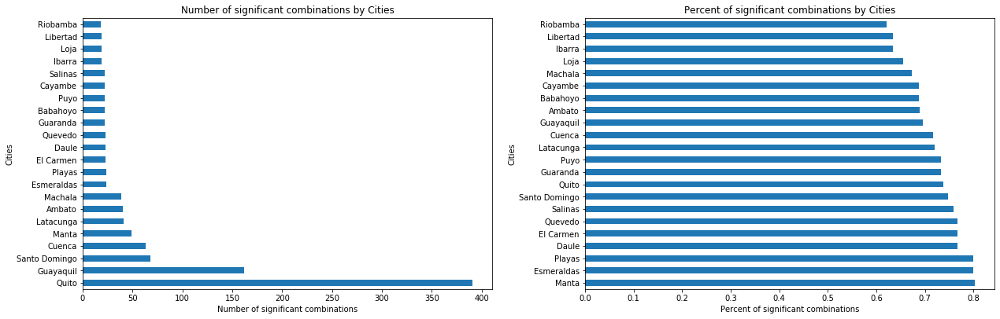


Overall, the analysis of the significance of promotions here largely agree with the visualization regarding cities vs transactions above. Playas, Manta, El Carmen are among the top cities that have effective promotions. It might or might not be attributed to a small number of very large promotions that they showed to have. Meanwhile, cities like Daule and Salinas shows a decent upward trend, and they are also among the top cities on this chart. Cities that show more of a downward trend like Riobamba and Loja are among the least promotion-effective cities. 


```python
percent_prod = (significant_df['products'].value_counts()/all_combination_df['products'].value_counts()).dropna().sort_values(ascending=False)

fig, ax = plt.subplots(1, 2, figsize=(18, 6))
significant_df[significant_df.cities == 'Quito']['products'].value_counts()[np.r_[0:8, -8:0]].plot(kind='barh', color = ['#003f5c'] *8 + ['#ffa600']*8, ax = ax[0])
ax[0].set_title("8 Top and Bottom-Selling products when there is promotion")
ax[0].set_xlabel("Count of cases with increased sales")

percent_prod[np.r_[0:8, -8:0]].plot(kind='barh', ax = ax[1], color = ['#003f5c'] *8 + ['#ffa600']*8)
ax[1].set_title("Percent of 8 Top and Bottom-Selling products when there is promotion")
ax[1].set_xlabel("Percent of significant combinations")
plt.tight_layout(2)
plt.show()
```


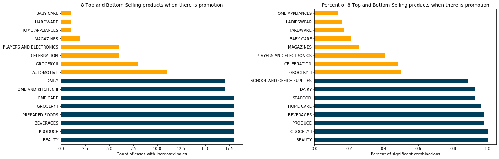


```python
percent_store = (significant_df['store_num'].value_counts()/all_combination_df['store_num'].value_counts()).dropna().sort_values(ascending=False)
plt.figure(figsize=(10, 6))
plt.title("8 Top and Bottom-Selling stores when there is promotion")
plt.xlabel("Store number")
plt.ylabel("Percent of significant combinations")
percent_store[percent_store.index[np.r_[0:8, -8:0]]].plot(kind='bar', color = ['#003f5c'] *8 + ['#ffa600']*8);
```


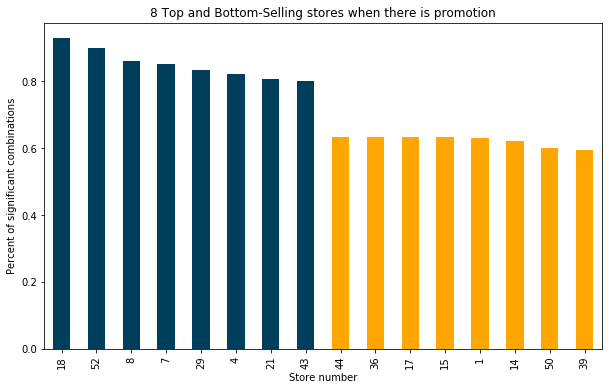


#### How much does sales increase? - Analysis of the coefficients of the models


```python
# retrieve the orders
arima_models = list()
seasonal_models = list()
intercept = list()
file_text = open('progress.txt', "r")
while True: # read till EOF
    file_line = file_text.readline()
    if not file_line:
        print("End Of File")
        break
    orders = file_line.split(": ")[-1]
    orders = orders.strip().split("|")
    arima_models.append(eval(orders[0]))
    seasonal_models.append(eval(orders[1]))
    intercept.append(orders[2])

file_text.close()
```

    End Of File


```python
#merge with the combinations
all_combination_df['seasonal_orders'] = seasonal_models
all_combination_df['arima_orders'] = arima_models
all_combination_df['intercept'] = intercept
significant_df = significant_df.merge(all_combination_df, how = 'left', on = ['store_num', 'cities', 'products'])
significant_df.head()
```


<div>
<style scoped>
    .dataframe tbody tr th:only-of-type {
        vertical-align: middle;
    }

    .dataframe tbody tr th {
        vertical-align: top;
    }

    .dataframe thead th {
        text-align: right;
    }
</style>
<table border="1" class="dataframe">
  <thead>
    <tr style="text-align: right;">
      <th></th>
      <th>cities</th>
      <th>products</th>
      <th>store_num</th>
      <th>seasonal_orders</th>
      <th>arima_orders</th>
      <th>intercept</th>
    </tr>
  </thead>
  <tbody>
    <tr>
      <th>0</th>
      <td>Ambato</td>
      <td>AUTOMOTIVE</td>
      <td>50</td>
      <td>(2, 0, 0, 7)</td>
      <td>(2, 0, 0)</td>
      <td>T</td>
    </tr>
    <tr>
      <th>1</th>
      <td>Ambato</td>
      <td>BEVERAGES</td>
      <td>23</td>
      <td>(1, 0, 0, 7)</td>
      <td>(1, 0, 0)</td>
      <td>T</td>
    </tr>
    <tr>
      <th>2</th>
      <td>Ambato</td>
      <td>BEAUTY</td>
      <td>50</td>
      <td>(2, 0, 1, 7)</td>
      <td>(1, 0, 1)</td>
      <td>T</td>
    </tr>
    <tr>
      <th>3</th>
      <td>Ambato</td>
      <td>BEAUTY</td>
      <td>23</td>
      <td>(2, 0, 1, 7)</td>
      <td>(1, 0, 1)</td>
      <td>T</td>
    </tr>
    <tr>
      <th>4</th>
      <td>Ambato</td>
      <td>BEVERAGES</td>
      <td>50</td>
      <td>(1, 0, 2, 7)</td>
      <td>(1, 0, 0)</td>
      <td>T</td>
    </tr>
  </tbody>
</table>
</div>


```python
# retrain models to retrieve the coefficients
coefs = list()
for i in range(len(significant_df)):
    c = significant_df.iloc[i]
    temp = create_subset(main, family = c['products'], city = c['cities'], store_nbr = c['store_num'])
    if c['intercept'] == "T":
        model = SARIMAX(temp.sales, exog=temp.bool_promotion, order=c['arima_orders'], seasonal_order=c['seasonal_orders'], trend='c', enforce_stationarity=False).fit(max_iter=50)
    else:
        model = SARIMAX(temp.sales, exog=temp.bool_promotion, order=c['arima_orders'], seasonal_order=c['seasonal_orders'], enforce_stationarity=False).fit(max_iter=50)
    coefs.append(model.params['bool_promotion'])
```


```python
significant_df['promo_coefs'] = coefs 
```


```python
# investigate the distribution of the coefficients
print(significant_df['promo_coefs'].describe())
print("Number of promotion decreasing sales: ", sum(significant_df['promo_coefs'] <= 0))
```

    count     1155.000000
    mean       421.404119
    std       1278.887059
    min       -104.483301
    25%          3.413362
    50%         17.941188
    75%        154.324585
    max      10800.397502
    Name: promo_coefs, dtype: float64
    Number of promotion decreasing sales:  24


```python
# examine the products where promotions appear to drive down sales
significant_df[significant_df.promo_coefs < 0]
```


<div>
<style scoped>
    .dataframe tbody tr th:only-of-type {
        vertical-align: middle;
    }

    .dataframe tbody tr th {
        vertical-align: top;
    }

    .dataframe thead th {
        text-align: right;
    }
</style>
<table border="1" class="dataframe">
  <thead>
    <tr style="text-align: right;">
      <th></th>
      <th>cities</th>
      <th>products</th>
      <th>store_num</th>
      <th>seasonal_orders</th>
      <th>arima_orders</th>
      <th>intercept</th>
      <th>promo_coefs</th>
    </tr>
  </thead>
  <tbody>
    <tr>
      <th>57</th>
      <td>Babahoyo</td>
      <td>PREPARED FOODS</td>
      <td>31</td>
      <td>(0, 0, 0, 0)</td>
      <td>(1, 0, 4)</td>
      <td>T</td>
      <td>-4.121328</td>
    </tr>
    <tr>
      <th>96</th>
      <td>Cuenca</td>
      <td>DAIRY</td>
      <td>37</td>
      <td>(1, 0, 0, 7)</td>
      <td>(1, 0, 0)</td>
      <td>T</td>
      <td>-49.097254</td>
    </tr>
    <tr>
      <th>107</th>
      <td>Cuenca</td>
      <td>EGGS</td>
      <td>42</td>
      <td>(0, 0, 0, 0)</td>
      <td>(1, 0, 0)</td>
      <td>T</td>
      <td>-2.951847</td>
    </tr>
    <tr>
      <th>165</th>
      <td>Daule</td>
      <td>MEATS</td>
      <td>27</td>
      <td>(1, 0, 1, 7)</td>
      <td>(2, 0, 1)</td>
      <td>T</td>
      <td>-37.971939</td>
    </tr>
    <tr>
      <th>224</th>
      <td>Guaranda</td>
      <td>DELI</td>
      <td>19</td>
      <td>(1, 0, 0, 7)</td>
      <td>(3, 0, 0)</td>
      <td>T</td>
      <td>-14.203077</td>
    </tr>
    <tr>
      <th>225</th>
      <td>Guaranda</td>
      <td>GROCERY II</td>
      <td>19</td>
      <td>(1, 0, 1, 7)</td>
      <td>(2, 0, 0)</td>
      <td>T</td>
      <td>-0.377927</td>
    </tr>
    <tr>
      <th>345</th>
      <td>Guayaquil</td>
      <td>MEATS</td>
      <td>28</td>
      <td>(1, 0, 1, 7)</td>
      <td>(0, 0, 0)</td>
      <td>F</td>
      <td>-18.457109</td>
    </tr>
    <tr>
      <th>433</th>
      <td>Latacunga</td>
      <td>DELI</td>
      <td>13</td>
      <td>(0, 0, 0, 0)</td>
      <td>(5, 0, 0)</td>
      <td>T</td>
      <td>-0.804859</td>
    </tr>
    <tr>
      <th>448</th>
      <td>Latacunga</td>
      <td>MEATS</td>
      <td>13</td>
      <td>(1, 0, 1, 7)</td>
      <td>(1, 0, 1)</td>
      <td>T</td>
      <td>-4.860549</td>
    </tr>
    <tr>
      <th>467</th>
      <td>Libertad</td>
      <td>DELI</td>
      <td>36</td>
      <td>(2, 0, 0, 7)</td>
      <td>(1, 0, 0)</td>
      <td>T</td>
      <td>-11.184018</td>
    </tr>
    <tr>
      <th>527</th>
      <td>Machala</td>
      <td>PERSONAL CARE</td>
      <td>40</td>
      <td>(2, 0, 0, 7)</td>
      <td>(1, 0, 0)</td>
      <td>T</td>
      <td>-0.045638</td>
    </tr>
    <tr>
      <th>574</th>
      <td>Manta</td>
      <td>PET SUPPLIES</td>
      <td>52</td>
      <td>(1, 0, 1, 3)</td>
      <td>(1, 0, 0)</td>
      <td>T</td>
      <td>-1.354049</td>
    </tr>
    <tr>
      <th>723</th>
      <td>Quito</td>
      <td>CLEANING</td>
      <td>3</td>
      <td>(0, 0, 1, 7)</td>
      <td>(0, 0, 1)</td>
      <td>T</td>
      <td>-4.940221</td>
    </tr>
    <tr>
      <th>740</th>
      <td>Quito</td>
      <td>DAIRY</td>
      <td>3</td>
      <td>(1, 0, 1, 7)</td>
      <td>(0, 0, 0)</td>
      <td>F</td>
      <td>-104.483301</td>
    </tr>
    <tr>
      <th>755</th>
      <td>Quito</td>
      <td>DELI</td>
      <td>1</td>
      <td>(1, 0, 0, 7)</td>
      <td>(1, 0, 1)</td>
      <td>T</td>
      <td>-5.772120</td>
    </tr>
    <tr>
      <th>770</th>
      <td>Quito</td>
      <td>EGGS</td>
      <td>2</td>
      <td>(1, 0, 1, 7)</td>
      <td>(0, 0, 0)</td>
      <td>T</td>
      <td>-1.032770</td>
    </tr>
    <tr>
      <th>772</th>
      <td>Quito</td>
      <td>EGGS</td>
      <td>6</td>
      <td>(1, 0, 1, 7)</td>
      <td>(0, 0, 0)</td>
      <td>T</td>
      <td>-4.586273</td>
    </tr>
    <tr>
      <th>821</th>
      <td>Quito</td>
      <td>GROCERY II</td>
      <td>48</td>
      <td>(1, 0, 2, 7)</td>
      <td>(2, 0, 1)</td>
      <td>T</td>
      <td>-7.129332</td>
    </tr>
    <tr>
      <th>918</th>
      <td>Quito</td>
      <td>MEATS</td>
      <td>1</td>
      <td>(1, 0, 1, 7)</td>
      <td>(0, 0, 0)</td>
      <td>F</td>
      <td>-34.378843</td>
    </tr>
    <tr>
      <th>929</th>
      <td>Quito</td>
      <td>MEATS</td>
      <td>44</td>
      <td>(1, 0, 1, 7)</td>
      <td>(2, 0, 0)</td>
      <td>T</td>
      <td>-80.246005</td>
    </tr>
    <tr>
      <th>978</th>
      <td>Quito</td>
      <td>POULTRY</td>
      <td>17</td>
      <td>(1, 0, 2, 7)</td>
      <td>(1, 0, 0)</td>
      <td>T</td>
      <td>-3.607940</td>
    </tr>
    <tr>
      <th>1051</th>
      <td>Riobamba</td>
      <td>BREAD/BAKERY</td>
      <td>14</td>
      <td>(1, 0, 0, 7)</td>
      <td>(1, 0, 0)</td>
      <td>T</td>
      <td>-7.473650</td>
    </tr>
    <tr>
      <th>1131</th>
      <td>Santo Domingo</td>
      <td>MEATS</td>
      <td>5</td>
      <td>(2, 0, 1, 7)</td>
      <td>(2, 0, 0)</td>
      <td>T</td>
      <td>-27.818218</td>
    </tr>
    <tr>
      <th>1147</th>
      <td>Santo Domingo</td>
      <td>PREPARED FOODS</td>
      <td>21</td>
      <td>(1, 0, 2, 7)</td>
      <td>(1, 1, 1)</td>
      <td>T</td>
      <td>-0.144202</td>
    </tr>
  </tbody>
</table>
</div>


```python
plt.title("Histogram of how many units of sales increase when there \n is promotion across all combinations")
plt.xlabel("Coefficients - Change in unit of sales")
plt.hist(np.log(significant_df['promo_coefs']), bins = 50);
```


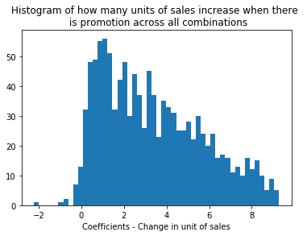


```python
# products that got a big increaase in sales when they are promoted
significant_df[significant_df.promo_coefs > 5000]
```


<div>
<style scoped>
    .dataframe tbody tr th:only-of-type {
        vertical-align: middle;
    }

    .dataframe tbody tr th {
        vertical-align: top;
    }

    .dataframe thead th {
        text-align: right;
    }
</style>
<table border="1" class="dataframe">
  <thead>
    <tr style="text-align: right;">
      <th></th>
      <th>cities</th>
      <th>products</th>
      <th>store_num</th>
      <th>seasonal_orders</th>
      <th>arima_orders</th>
      <th>intercept</th>
      <th>promo_coefs</th>
    </tr>
  </thead>
  <tbody>
    <tr>
      <th>19</th>
      <td>Ambato</td>
      <td>GROCERY I</td>
      <td>50</td>
      <td>(2, 0, 1, 7)</td>
      <td>(2, 0, 0)</td>
      <td>T</td>
      <td>6456.731023</td>
    </tr>
    <tr>
      <th>70</th>
      <td>Cayambe</td>
      <td>GROCERY I</td>
      <td>11</td>
      <td>(2, 0, 1, 7)</td>
      <td>(3, 0, 1)</td>
      <td>T</td>
      <td>7040.998561</td>
    </tr>
    <tr>
      <th>304</th>
      <td>Guayaquil</td>
      <td>GROCERY I</td>
      <td>51</td>
      <td>(0, 0, 0, 0)</td>
      <td>(2, 0, 1)</td>
      <td>T</td>
      <td>5108.058295</td>
    </tr>
    <tr>
      <th>381</th>
      <td>Guayaquil</td>
      <td>PRODUCE</td>
      <td>51</td>
      <td>(0, 0, 0, 0)</td>
      <td>(5, 0, 3)</td>
      <td>F</td>
      <td>5606.660148</td>
    </tr>
    <tr>
      <th>554</th>
      <td>Manta</td>
      <td>GROCERY I</td>
      <td>52</td>
      <td>(0, 0, 0, 0)</td>
      <td>(1, 0, 1)</td>
      <td>T</td>
      <td>6225.871541</td>
    </tr>
    <tr>
      <th>686</th>
      <td>Quito</td>
      <td>BEVERAGES</td>
      <td>3</td>
      <td>(2, 0, 1, 7)</td>
      <td>(5, 0, 2)</td>
      <td>T</td>
      <td>8340.248982</td>
    </tr>
    <tr>
      <th>697</th>
      <td>Quito</td>
      <td>BEVERAGES</td>
      <td>46</td>
      <td>(2, 0, 0, 7)</td>
      <td>(2, 0, 1)</td>
      <td>T</td>
      <td>5654.516306</td>
    </tr>
    <tr>
      <th>699</th>
      <td>Quito</td>
      <td>BEVERAGES</td>
      <td>45</td>
      <td>(1, 0, 2, 7)</td>
      <td>(1, 0, 0)</td>
      <td>T</td>
      <td>8534.820025</td>
    </tr>
    <tr>
      <th>700</th>
      <td>Quito</td>
      <td>BEVERAGES</td>
      <td>44</td>
      <td>(2, 0, 0, 7)</td>
      <td>(2, 0, 1)</td>
      <td>T</td>
      <td>9552.248355</td>
    </tr>
    <tr>
      <th>703</th>
      <td>Quito</td>
      <td>BEVERAGES</td>
      <td>47</td>
      <td>(0, 0, 0, 0)</td>
      <td>(1, 0, 1)</td>
      <td>F</td>
      <td>8055.779197</td>
    </tr>
    <tr>
      <th>796</th>
      <td>Quito</td>
      <td>GROCERY I</td>
      <td>3</td>
      <td>(1, 0, 1, 7)</td>
      <td>(2, 0, 0)</td>
      <td>T</td>
      <td>8443.444167</td>
    </tr>
    <tr>
      <th>799</th>
      <td>Quito</td>
      <td>GROCERY I</td>
      <td>6</td>
      <td>(2, 0, 0, 7)</td>
      <td>(1, 0, 0)</td>
      <td>F</td>
      <td>5018.767052</td>
    </tr>
    <tr>
      <th>800</th>
      <td>Quito</td>
      <td>GROCERY I</td>
      <td>8</td>
      <td>(1, 0, 0, 7)</td>
      <td>(3, 0, 4)</td>
      <td>F</td>
      <td>5122.428728</td>
    </tr>
    <tr>
      <th>806</th>
      <td>Quito</td>
      <td>GROCERY I</td>
      <td>45</td>
      <td>(2, 0, 2, 7)</td>
      <td>(0, 0, 3)</td>
      <td>T</td>
      <td>10800.397502</td>
    </tr>
    <tr>
      <th>807</th>
      <td>Quito</td>
      <td>GROCERY I</td>
      <td>44</td>
      <td>(2, 0, 0, 7)</td>
      <td>(3, 0, 2)</td>
      <td>F</td>
      <td>10371.945421</td>
    </tr>
    <tr>
      <th>808</th>
      <td>Quito</td>
      <td>GROCERY I</td>
      <td>9</td>
      <td>(0, 0, 0, 7)</td>
      <td>(1, 0, 0)</td>
      <td>T</td>
      <td>6708.441989</td>
    </tr>
    <tr>
      <th>809</th>
      <td>Quito</td>
      <td>GROCERY I</td>
      <td>20</td>
      <td>(2, 0, 1, 7)</td>
      <td>(1, 0, 0)</td>
      <td>T</td>
      <td>5296.532400</td>
    </tr>
    <tr>
      <th>810</th>
      <td>Quito</td>
      <td>GROCERY I</td>
      <td>46</td>
      <td>(1, 0, 1, 7)</td>
      <td>(1, 0, 0)</td>
      <td>T</td>
      <td>9378.659362</td>
    </tr>
    <tr>
      <th>811</th>
      <td>Quito</td>
      <td>GROCERY I</td>
      <td>49</td>
      <td>(1, 0, 1, 7)</td>
      <td>(1, 0, 1)</td>
      <td>T</td>
      <td>7899.298335</td>
    </tr>
    <tr>
      <th>812</th>
      <td>Quito</td>
      <td>GROCERY I</td>
      <td>47</td>
      <td>(1, 0, 1, 7)</td>
      <td>(1, 0, 0)</td>
      <td>T</td>
      <td>10207.247656</td>
    </tr>
    <tr>
      <th>813</th>
      <td>Quito</td>
      <td>GROCERY I</td>
      <td>48</td>
      <td>(2, 0, 1, 7)</td>
      <td>(1, 0, 1)</td>
      <td>T</td>
      <td>8334.066160</td>
    </tr>
    <tr>
      <th>999</th>
      <td>Quito</td>
      <td>PRODUCE</td>
      <td>3</td>
      <td>(0, 0, 2, 7)</td>
      <td>(1, 0, 2)</td>
      <td>T</td>
      <td>8442.797736</td>
    </tr>
    <tr>
      <th>1014</th>
      <td>Quito</td>
      <td>PRODUCE</td>
      <td>49</td>
      <td>(0, 0, 0, 0)</td>
      <td>(4, 0, 3)</td>
      <td>T</td>
      <td>8258.172075</td>
    </tr>
  </tbody>
</table>
</div>


```python
fig, axes = plt.subplots(5, 5, figsize = (20, 20))

for i, city in enumerate(np.unique(significant_df.cities)):
    temp = significant_df[significant_df.cities == city]
    axes[int(i/5)][i%5].hist(np.log(temp['promo_coefs']))
    axes[int(i/5)][i%5].set_title("{}".format(city))
    axes[int(i/5)][i%5].set_xlabel("Coefficients - Change in unit of sales\n (log scale)", fontsize = 12)
    axes[int(i/5)][i%5].set_ylabel("Count")

plt.tight_layout(pad=2)
plt.suptitle("Histogram of how many units of sales increase when there \n is promotion by City\n", fontsize = 20)
plt.show()
```


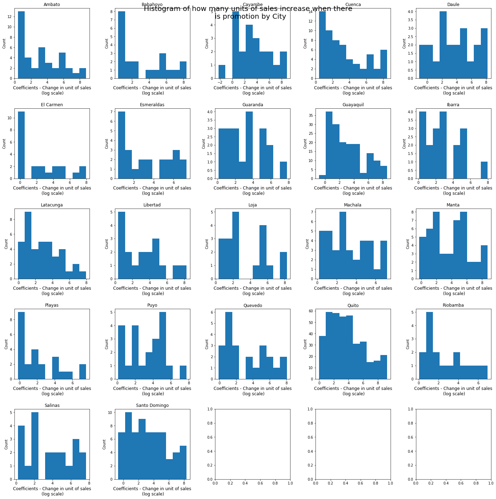


**Remarks**: For most cases, promotion increases sales by at least one unit (the log is positive). Grocery I, beverages and several produce products experience more than 5000 units increase in sales. Cities like Manta, Daule, Santo Domingo and Guaranda have a more even/closer-to-normal distribution of coefficients. Promotions that are more right-skewed, in cities like Ambato, Playas, El Carmen have smaller effects, but as we have analyzed earlier, they come in great quantity (many promotions are effective)

There are also around 20 cases where promotion affects sales negatively. Out of these cases, the most serious ones (decrease sales by 20 units and above) include diary and meat products.


```python
# save the resulting dataframe 
significant_df.to_csv('significant_results.csv', index = False)
```

## 6. Conclusion and Next step

More than 70% of the promotions have a positive effect on sales and the majority of them result in a good amount of boost in the units sold of certain products. How promotions affect sales differ by locations and by products. Some products score 100% on sales with the presence of promotions, while some experience a slight decrease. Some cities have more, but smaller-effect promotions and some cities have fewer but larger-effect promotions on sales. 

Some next steps include:
- We can focus on a select few combinations (maybe regarding locations, products) to further investigate their statistics. It can be retrained and we can examine the fitness of models + use it to predict the next periods.
- Combine the results in sales with the knowledge of customer demographics and inventories to develop a better promotion strategy for the different products at different locations so as to minimize loss in inventory and increase sales
- Combine the results with the knowledge of products to see why certain products are affected negatively. Would it be more than just expiration dates?
- Study why in some cities like Riobamba promotions appear to slow sales compared to other cities. 
- Can take holidays into consideration. The holiday data currently is hard to model along with other variables so we can dive deeper and analyze a small period of sales where holidays occur and examine how sales changed. 
